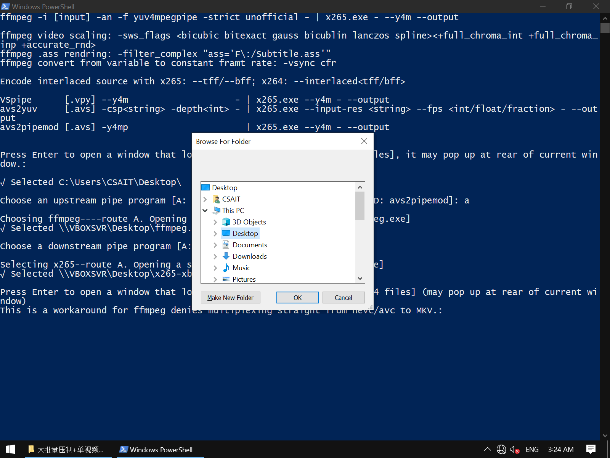

# PowerShell+CMD-batch based multiple/single encoding/multiplexing scripts suite

## ☆Environment prerequsities

 - One ounce of ffprobe (usually included with ffmpeg downloads)
 - One gallon of ffmpeg/Vapoursynth (vspipe)/Avisynth (avs2yuv)/Avisynth (avs2pipemod)
 - One cup of x264/x265

## ★Advantages

 - Python-free, satisfies entry level video editors' needs to work out-of-shelf
 - Simply follow the script's guide & supply the correct information
 - The script is natually uncompiled,which makes debugging & adding features to be quick & easy
 - The encoding steps supports 4 upstream pipe programs (ffmpeg, vspipe, avs2yuv, avs2pipemod)
   - as well as 2 downstream  programs (x264, x265), in total of 8 different routes

Chart of encoding-workflow's routes
 

 - The multiplexing/encapsulating/containing step supports analysis of containers, special containers, video streams, audio tracks, subtitle tracks, font tracks
    - as well as 4 output format options, with their compatibility check

Chart of multiplexing-workflow's routes (later added supports to VP9, FLAC, MXF)

<del>Not really that complex in the code, but logically yes</del>
 

 - Auto-filling colorspace, bitdepth, resolution & framerate to ffmpeg, avs2yuv, x264, x265's options
 - Batch encoding workflow supports over 15000 individual tasks, with user options to pause/stop in middle of each tasks
 - Developed Fixed+Vary (par-var) structure of commandline assignment, the end-user could easily alter the "Var"s to repurpose for encode option/value testing
 - Developed Encoder+Controller (enc-ctrl) batch layout, which greatly simplfies large-volume tasks' commandline
 - Setlocal+Endlocal, CMD /k and many for repeated-runs free of interference from previously assigned variables

-----

## ▲How to run

 1. Unzip downloaded files, the step 2's generated batch file works as the parts/components to be assembled & activated by step 3's generated batch - controller. The single/multiple mode indicates development was made for single video, or multiple episodes of videos
 2. Choose inbetween single & multiple encode jobs, start from top to bottom. right click & select "Edit" or "Run with PowerShell". Follow the interactive prompts to fill the needed information. Batch script(s) will be generated in the end.

 3. When encoder batch(s) with its/their corresponding controller batch gets generated, make sure both of them are in the same directory/folder. Simply doubleclick to start encoding tasks

 4. Finally, run the .ps1 for multiplexing, follow the interactive prompts to repeat import streams/tracks that is going to be multiplexed into 1 container file (usually 1 episode). Finally choose the output container format to finish off

## ★Downloads
1: <a href='./bbenc-source'>Github directlink</a>, 
2: <a href='https://drive.google.com/drive/folders/170tmk7yJBIz5eJuy7KXzqIgtvtDajyDu?usp=sharing'>Google drive</a>

Apdx α: <a href='https://www.nazorip.site/archives/44/'>QAAC audio encoder tutorial</a>OR<a href='https://github.com/iAvoe/QAAC-Tutorial-Standalone/blob/master/%E6%95%99%E7%A8%8B.md'>Github</a> (chromium/firefox-plugin webpage translation is required) 

Apdx β: <a href='https://nazorip.site/archives/169/'>ffprobe stream media probing tutorial</a>OR<a href='https://github.com/iAvoe/FFprobe-Tutorial-Standalone/blob/master/教程.md'>Github</a> (chromium/firefox-plugin webpage translation is required) 

δ: Download ffmpeg, ffprobe: <a href='http://ffmpeg.org/download.html'>official builds</a>OR<a href='https://ottverse.com/ffmpeg-builds'>Ottverse builds</a> 

ε: Download x264,  x265: <a href='http://www.mediafire.com/?6lfp2jlygogwa'>LigH (x265)</a>、
<a href='https://www.mediafire.com/?bxvu1vvld31k1'>LigH (x264)</a>、
<a href='https://drive.google.com/drive/u/0/folders/0BzA4dIFteM2dWEpvWGZXV3ZhdTA'>Rigaya (x265)</a>、
<a href='https://www.mediafire.com/folder/arv5xmdqyiczc'>Patman (x264 x265)</a>、
<a href='https://github.com/DJATOM/x265-aMod/releases'>DJATOM (x265)</a>、
<a href='https://down.7086.in/'>MeteorRain/7086 (x265)</a>
  

## ☆Trinkgeld a cup of coffee =_=

-----

## ☆Dev notes

**IDE**
 - This project was coded on Notepad, VSCode & PowerShell ISE. It's recommended to develop (e.g., port to another coding language) with integrated development environment (IDE) with colorcoding & comfy interface due to the sheer amount of content

**utf8+BOM text codec is required for PowerShell**
 - Under the 4 horsemen of PowerShell, PowerShell ISE, CMD/batch & UTF-8 filenames. UTF-8BOM text codec is the only option. However the generated CMD batches are coded with UTF-8NoBOM
 - PowerShell，PowerShell ISE shraightup fail to decode UTF-8NoBOM
 - CMD doesn't support Unicode（UTF-16LE？）
 - PowerShell 5.1 does not natively support UTF-8NoBOM
 - however PowerShell 7 mandate users to run scripts with purely commandline, which is not acceptable, and caused the later shift to realize some of PS7's features in PowserShell 5.1

**PowerShell generate multi-line string with loop**
 - Declare an array and string variable: ` $StrArray=@(); $MtlnString="" `
 - Aggregate string data into array from loop, place a \`n at rear: `` $StrArray+="some text `n"``
 - Pass array to string variable after loop finishes: ` [string]$MtlnString=$StrArray `
 - `` `n `` enables the line switching, but also creates a space start from the 2nd line: ` $MtlnString=$MtlnString -replace " some", "some" `

-----

## ☆At what cost?

 - Donated my winter break in a ~~vicious~~ cycle of adding features --> new feature creates bug --> debug --> add comments
 - This script suite is quite complex compared to most encoding programs, making it difficult to work with at beginning
 - A lot of cmdlets, variables are creeated for formatting cmdlines, by requirements from especially ffmpeg
 - The fear that I'll be joked at developing a twenty-hexadecimal (alphabet) carrying mathmatical operation within a for-loop to support 15000+ individual encodes
   - just to elinimate numbers in batch variables
 - To make multiplexing/containing script robust/very capable, a 168-line ~~turbo encabulator~~ function was developed after a hellish endurance-challenging debugs (mostly due to my lack of systematilly study of coding)
 - As I've being told, supporting this project in future would be difficult
 

**★Why not choosing develop w/ C++, TypeScript, JS**
 - I haven't studied them =_=, also the environment setup would make too much change to the OS（？）；PowerShell & PS ISE are the opposite
 - I know docker exists, but telling docker about my phone number just to begin study c++ is a no
 

**☆Why not choosing to develop w/ Python, like installing Python is not that hard**

Intalling Python is pretty straightforward, however in terms of IDEs:
 - Most people have never used Atom IDE, and some says it has performance issues on Windows
 - Python does not have a usable built-in IDE
 - VSCode needs too much effort of customizations, and their message poping is quite annoying for entry-level users（I'm used to it, though）
 - np++'s author is into white political bulls, and Vim is pure toture for entry-users
 - Sublime is premium and probably even less people uses it

This level of gatekeeping is a waste of time and efort for people who don't actually develop codes; In contrast, we have a clean, efficient and prety easy to use PowerShell ISE that is just better for entry-level users

-----

## ★Updates / change log

**Almost 1.0 v0.1619**
<ul>
    <li> √ Changed --pme option autofilling from 12 cores to 22 cores at least</li>
</ul>

**Almost 1.0 v0.1618**
<ul>
    <li> √ Fixed step 2 multiple & single encoding mode are having the same filename input (manual input option) prompt being the same, they are supposed to be different</li>
    <li> √ Add interactive text in step 2, 3 to let user know don't stack square brackets next to eachother to prevent regex misunderstanding</li>
</ul>
 
**Internal v0.1617**
<ul>
    <li> √ Organized supported media formats' list in step 5</li>
</ul>

**Internal v0.1610**
<ul>
    <li> √ Enhanced step 2, 3 & underlying encode modes' variable usage</li>
    <li> √ Fixed step 2's  both modes having Enc & Mux file extension variable assignment being misordered</li>
    <li> √ Enhanced step 2, 3 & underlying encode modes' interactive prompts, i.e., Write-Output is swapped with Write-Warning for warning specific texts</li>
    <li> √ Enhanced step 2, 3 & underlying encode modes' episode counter mechanism</li>
    <li> √ Added empty file import error intercepting mechanism for step 3 (though unnecessary)</li>
    <li> √ Fixed some spelling errors on interactive prompts in step 3</li>
    <li> √ Enhanced step 3 multi-encode modes' call option parsing has missed line breaks</li>
    <li> √ Enhanced step 3's interactive prompt to feedback paths that are imported</li>
    <li> √ Fixed step 3 multi-encode modes' $serial variable (from user input) being expanded too early</li>
    <li> √ Fixed problem from step 3 (multi-encode modes') episode counter variable were mixed into 3D axis iterator's variable</li>
    <li> √ Enhanced step 3 multi-encode modes' commenting</li>
    <li> √ Fixed step 3 multi-encode modes' importing path & file's variables being mixed into each other (which is ok in single-encode mode)</li>
    <li> √ Removed step 3 multi-encode modes' extra double quotes</li>
</ul>

**Internal v0.1570**
<ul>
    <li> √ Reviewed and improved many commenting texts among all steps</li>
    <li> √ Reviewed and improved many interactive prompt texts among all steps</li>
    <li> √ Added support to alac in step 5, as well as notification of supported container formats in corresponding</li>
    <li> √ Added support to flac in step 5, as well as notification of supported container formats in corresponding</li>
    <li> √ Added "support" to ape in step 5, (quits on error because it has no support)</li>
    <li> √ Added support to vp9 in step 5, as well as notification of supported container formats in corresponding</li>
    <li> √ Added support to apcn/ap4x in step 5, as well as notification of supported container formats in corresponding</li>
    <li> √ Added support to ass/ssa in step 5, as well as notification of supported container formats in corresponding</li>
    <li> √ Added support to multiplex/encapsulate MXF in step 5, as well as import detection to filter unsupported stream/track formats</li>
    <li> √ Step 2 - multiple encodes mode has completed English translation</li>
    <li> √ Step 2 - single encode mode has completed English translation</li>
    <li> √ Step 3 - multiple encodes mode has completed English translation</li>
    <li> √ Step 3 - single encode mode has completed English translation</li>
    <li> √ Step 5 - single encode mode has completed English translation</li>
    <li> √ Fixed a Switch statement error on step 5</li>
</ul>

**Internal v0.1151**
<ul>
    <li> √ Reduced 50 lines of code in step 2's multiple-encodes mode, as well as removing any uneccessary x264 interaction prompts that was previously designed for x265</li>
    <li> √ Reduced 25 lines of code in step 2's single-encodes mode, as well as removing any uneccessary x264 interaction prompts that was previously designed for x265</li>
    <li> √ Step 2 & 3 are in better syncs than ever</li>
</ul>

**Internal v0.1120**
<ul>
    <li>√ Step 3's multi-encode mode could now generate controller batch with user-specified amount of call commandlines for encoding</li>
    <li> √ Step 3's multi-encode mode now has 3 different filename specification methods, offers more convinences for end users</li>
    <li> √ Step 2, 3s' both modes now supports route for x264, although further debugging isrequired</li>
    <li> √  Step 2, 3 has many improvements on logic, which results more efficient code structures</li>
</ul>

**Internal v0.390**
<ul>
    <li> √ Lots of debugging was made</li>
    <li> √ Improved step 2, 3's both mode's x264 version (in future x264 version will be merged to x265 version)</li>
    <li> √ Reworked filename generation method change, especially how to differ inbetween multiple & single encoding mode</li>
    <li> √ Reworked on x264's colorspace option auto-filling, this also results x265 version to stop using short version of bitdepth option</li>
    <li> √ Completed x264 step 2's multi-encode mode script</li>
    <li> √ All encode generation steps for x264's route have passed testing</li>
    <li> √ Optimized avs2yuv, avs2pipemod route's option generation</li>
    <li> √ Step 2 of x265 verision of multi-encoding mode has completed ffmpeg temp-multiplex-to-MP4 roughwork. This portion will differ from single & multiple mode</li>
</ul>

**Internal v0.330**
<ul>
    <li> √ Autofill of option --pools in x265</li>
    <li> √ Created the roughwork of downstream route x264</li>
    <li> √ Autofill of option -r in ffmpeg</li>
    <li> √ Step 2, 3 (x265)'s single-encode mode has been added with ffmpegParB for creating MP4 container with ffmpeg, to workaround ffmpeg's limitation of multiplexing raw video stream to MKV</li>
    <li> √ Step 5 (to multiplex video streams) is now avaialble</li>
    <li> √ Step 5 is now capable to automatially deal with some export format's comaptibility with different stream/track media formats</li>
    <li> √ Step 5 now fully supports ffmpeg's commandline "typesetting"</li>
    <li> √ Step 5 now support fallback from empty codec_tag_string to codec_name under ffprobe probing</li>
    <li> √ Step 5 is born with the most complex codework than step 2, 3 combined</li>
    <li> √ Moved the option to select file types to export to the rear of prompt order</li>
</ul>

**Internal v0.190**
<ul>
    <li> √ Step 2 - x265 has added upstream route for avs2pipemod</li>
    <li> √ Merged all 4 routes (ffmpeg, VapourSynth, avs2yuv, avs2pipemod)  in step 2 as 1 file</li>
    <li> √ Improved step 2's multiple mode's maximum capacity</li>
    <li> √ Step 2, 3 could now alter pipline format based on upstream route selection (because 1 of them uses a different format)</li>
</ul>

**Internal v0.180**
<ul>
    <li> √ Added support to avs2pipemod in step 3</li>
    <li> √ Autofilling of x265 option --pme, </li>
    <li> √ Autofilling avs2yuv's colorspace and resolution option</li>
    <li> √ Added colorspace incompatibility warning (nv12, nv16) under avs2yuv & avs2pipemod</li>
    <li> √ Upgraded function to get path to automatially add slash at rear (inconsistency caused by root directory has slash, but folder doesn't)</li>
    <li> √ Planned 4 upstream routes + 2 downstream programs script design for encoding steps</li>
</ul>

**Earlier**
<ul>
    <li> √ Autofiling of --input-res, --colormatrix, --transfer, --fps, -D, -pix_fmt options for x265 & ffmpeg</li>
    <li> √ Realized UTF-8 NO BOM text codec to export files in PowerShell 5</li>
    <li> √ Realized high DPI render of Windows Forms (to select files & pathes)</li>
</ul>
