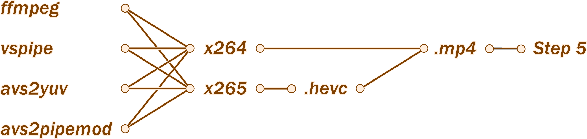
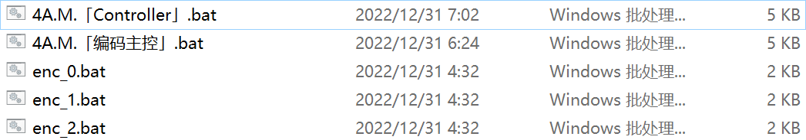

# Heavyduty PSScript+Batch based encoding & multiplexing scripts that works in singular & multiple file mode, & includes custom x264, x265 presets, & simple to use!

## ☆Environment prerequsities

 - One ounce of ffprobe (usually included with ffmpeg downloads)
 - One gallon of ffmpeg/Vapoursynth (vspipe)/Avisynth (avs2yuv)/Avisynth (avs2pipemod)
 - One cup of x264/x265

## ★Advantages

 - Python-free, satisfies entry level video editors' needs to work out-of-shelf
 - Auto-filling colorspace, bitdepth, resolution & framerate to ffmpeg, avs2yuv, x264, x265's options
 - Multiple encoding mode supports over 15000 individual tasks, with user options to pause/stop in middle of each tasks
 - Developed Fixed+Vary (par-var) structure of commandline assignment, the end-user could easily alter the "Var"s to repurpose for encode option/value testing
 - Developed Encoder+Controller (enc-ctrl) batch layout, which greatly simplfies large-volume tasks' commandline
 - Simply follow the script's guide & supply the correct information
 - The script is natually uncompiled,which makes debugging & adding features to be quick & easy
 - The encoding steps supports 5 upstream pipe programs (ffmpeg, vspipe, avs2yuv, avs2pipemod, svfi)
   - as well as 2 downstream  programs (x264, x265), in total of 10 different routes

Chart of encoding-workflow's routes
 

 - The multiplexing/encapsulating/containing step supports analysis of containers, special containers, video streams, audio tracks, subtitle tracks, font tracks
    - as well as 4 output format options, with their compatibility check

Chart of multiplexing-workflow's routes (later added supports to VP9, FLAC, MXF)

<del>Not really that complex in the code, but logically yes</del>
 

 - Setlocal+Endlocal, CMD /k and many for repeated-runs free of interference from previously assigned variables

-----

## ▲How to run
 1. Makesure language-pack corresponds to foreign-UTF8-filename is installed under Windows 11. E.g., to actually handle arabic filenames, go to `Settings --> Time & Language -->[Left pane] Languages --> Add a language --> Arabic`. This isn't mandatory on Windows 10
 2. Lift PSScript running restriction under Settings-->Update & Security-->For Developers:
 
 3. Unzip downloaded files
    - Step 2 generates a batch file that works as part(s)/component(s) to be assembled & activated by step 3's generated batch - the controlleris
    - Step 5 is a ffmpeg-based dedicated video multiplexing/container commandline generator, it works independently
    - The single/multiple mode indicates development was made for single video, or multiple episodes of videos
 4. Choose inbetween single & multiple encode jobs, start from top to bottom. right click & select "Edit" or "Run with PowerShell". Follow the interactive prompts to fill the needed information. Batch script(s) will be generated in the end.

 5. When encoder batch(s) with its/their corresponding controller batch gets generated, make sure both of them are in the same directory/folder. Simply doubleclick to start encoding tasks

Screenshot of running multi-encoding batch (under early stage testing)
 
 6. Finally, run the .ps1 for multiplexing, follow the interactive prompts to repeat import streams/tracks that is going to be multiplexed into 1 container file (usually 1 episode). Finally choose the output container format to finish off

## ★Downloads
1: <a href='./bbenc-source'>Github directlink</a>, 
2: <a href='https://drive.google.com/drive/folders/170tmk7yJBIz5eJuy7KXzqIgtvtDajyDu?usp=sharing'>Google drive</a>

Apdx α: <a href='https://www.nazorip.site/archives/44/'>QAAC audio encoder tutorial</a> or <a href='https://github.com/iAvoe/QAAC-Tutorial-Standalone/blob/master/%E6%95%99%E7%A8%8B.md'>Github</a> (chromium/firefox-plugin webpage translation is required) 

Apdx β: <a href='https://nazorip.site/archives/169/'>ffprobe stream media probing tutorial</a> or <a href='https://github.com/iAvoe/FFprobe-Tutorial-Standalone/blob/master/教程.md'>Github</a> (chromium/firefox-plugin webpage translation is required) 

δ: Download ffmpeg, ffprobe: <a href='http://ffmpeg.org/download.html'>official builds</a> or <a href='https://ottverse.com/ffmpeg-builds'>Ottverse builds</a> 

ε: Download x264,  x265: <a href='http://www.mediafire.com/?6lfp2jlygogwa'>LigH (x265)</a>、
<a href='https://www.mediafire.com/?bxvu1vvld31k1'>LigH (x264)</a>、
<a href='https://github.com/jpsdr/x264/releases'>jspdr (x264 tMod)</a>、
<a href='https://github.com/jpsdr/x265/releases'>jspdr (x265 auto-aq Mod)</a>、
<a href='https://drive.google.com/drive/u/0/folders/0BzA4dIFteM2dWEpvWGZXV3ZhdTA'>Rigaya (x265)</a>、
<a href='https://www.mediafire.com/folder/arv5xmdqyiczc'>Patman (x264 x265)</a>、
<a href='https://github.com/DJATOM/x265-aMod/releases'>DJATOM (x265)</a>、
<a href='https://down.7086.in/'>MeteorRain/7086 (x265)</a>
  

## ☆Trinkgeld a cup of coffee =_=

-----

## ☆Dev notes

**IDE**
 - This project was coded on Notepad, VSCode & PowerShell ISE. It's recommended to develop (e.g., port to another coding language) with integrated development environment (IDE) with colorcoding & comfy interface due to the sheer amount of content

**utf8+BOM text codec is required for PowerShell**
 - Under the 4 horsemen of PowerShell, PowerShell ISE, CMD/batch & UTF-8 filenames. UTF-8BOM text codec is the only option. However the generated CMD batches are coded with UTF-8NoBOM
 - PowerShell，PowerShell ISE shraightup fail to decode UTF-8NoBOM
 - CMD doesn't support Unicode（UTF-16LE？）
 - PowerShell 5.1 does not natively support UTF-8NoBOM
 - however PowerShell 7 mandate users to run scripts with purely commandline, which is not acceptable, and caused the later shift to realize some of PS7's features in PowserShell 5.1

**PowerShell generate multi-line string with loop**
 - Declare an array and string variable: ` $StrArray=@(); $MtlnString="" `
 - Aggregate string data into array from loop, place a \`n at rear: `` $StrArray+="some text `n"``
 - Pass array to string variable after loop finishes: ` [string]$MtlnString=$StrArray `
 - `` `n `` enables the line switching, but also creates a space start from the 2nd line: ` $MtlnString=$MtlnString -replace " some", "some" `

**ffmpeg raw-hevc-to-MKV restriction**
 - This socfgmrnugyew restriction made this project so much more difficult to code

-----

## ★Updates / change log
<ul>
    <li>√ Logical change in Step 2S & 2M to delete the "temporary multiplex" commandline generation: to show a reminder after selecting x265 downstream</li>
    <li>√ Created a keyRoute & altRoute cmdline generation method:<ul>
        <li>√ Program importing loop & switch statement update:<ul>
            <li>√ Merged upstream & downstream import into one single loop</li>
            <li>√ User now can import multiple upstream & downstream programs</li>
            <li>√ User now can select which route to use for this time, and switching routes manually in seconds in the generated batch</li>
            <li>√ The script will return a table clearly shows upstream & downstream routes available based on previous import</li>
            <li>√ A bit improved error handling for rare occasions</li></ul>
        </li></ul>
    </li>
    <li>√ A Switch that automatically takes operating mode, user selected upstream, & downstream (and their requirements) into account to generate the keyRoute variable<ul>
        <li>√ Variable collapse for `$sChar is programmed for multiple encoding mode due to the early variable assignment and string generation within the same variable are executed</li></ul>
    </li>
    <li>√ A loop that generates the altRoute variable:<ul>
        <li>√ Automatically figure out possible (commented-out) UNIX pipe combinations, which allows the user to quickly replace the keyRoute in the generated batch, as the "map of all programs" feature</li>
        <li>√ Variable collapse for `$sChar ... again</li></ul>
    </li>
    <li>√ The generated batch file step headings, and EOF PSScript prompt are also improved with info on how to manange and handle these generated batch for a long time</li>
    <li>√ Added a detect-&-differ keyRoute & altRoute variable generation where AVS2pipeMod upstream has a different format of UNIX pipe in step 2</li>
    <li>√ Improved whichlocation Function (locate path): the Windows Form window now shows up on top instead of behind the current PowerShell/ISE window</li>
    <li>√ Implemented much better Array to String, Table to String printing with Out-String<ul>
        <li>√ Solved "Array to string and expand variable in 1 line" problem with brackets outside the Array pipe to Out-String, then nested with variable exansion function</li></ul>
    </li>
    <li>√ Centralized all common errors & warnings into Function calls in Step 2, this greatly simplfied code management</li>
    <li>√ Added a detect-&-differ dnPipeStr variable generation by detecting empty pipe streams by string length, where the multiple-encoding mode is 1 char longer than single-encoding mode</li>
    <li>√ Added a detect-&-differ for text write-lines codeblock that generates batch file(s) in step 2, where multiple encoding mode requires a variable expansion on variable "s" to become the filename</li>
    <li>√ Tested and minor-tweaked the entire step 2</li>
    <li>√ Examined the logical & variable connectivity with step 3 and everything was good</li>
    <li>√ Completed the entire CHS Step 2S --> CHS Step 2M code migration</li>
    <li>√ Completed the entire CHS Step 2S --> ENG Step 2S code migration</li>
    <li>√ Completed the entire CHS Step 2S --> ENG Step 2S lang migration</li>
    <li>√ Completed the entire CHS Step 2M --> ENG Step 2M code migration</li>
    <li>√ Completed the entire CHS Step 2M --> ENG Step 2M lang migration</li>
</ul>

**v1.2380**
<ul>
    <li>Lots of changes in commenting, prompt-txt to make it concise and more readable (around 150 lines)</li>
    <li> √ Step 2:<ul>
        <li> √ Moved the entire file output name specifying codline into a Function</li>
        <li> √ Reconstruction of the entire Batch writing Switching statement</li>
        <li> √ Temporary multiplexing output disabled for x264 downstream pathway (with variable MUXwrt)</li>
        <li> √ Added a REM print to explain what does xxxVar do in the generated batch</li>
        <li> √ Retired some variables that ended up only being intermediates (overdesign)</li>
        <li> √ More in-batch "REM" & PSScript prompt informations in the end that tells user what to do and whether to keep generated batches</li>
        <li> √ Improved all warning/error prompt & commented texts for all the functions</li>
        <li> √ Logic improvements (optimizations) in all Functions, Statements, Switches, Pathways (up-downstreaming)</li></ul>
    </li>
    <li> √ Step 3:<ul>
        <li> √ Moved the entire file output name specifying codline into a Function</li>
        <li> √ Fixed: stream_tag difference in MOV container format causing failures, by isolating MOV & non-MOV code execusion</li>
        <li> √ switchOPS variable added to work-around varible-in-the-string prompting failure wihtin a function</li>
        <li> √ Added: yuva444p10le, yua444p12le support</li>
        <li> √ Fixed: differenciate x264's yuv-for-mpeg commandline being different than x265</li>
        <li> √ Moved "chcp 65001" to the top of the batch commandline due to issues with "REM" texts failed to display</li>
        <li> √ More input validations such as preventing ".exe" from entered into stream input</li>
        <li> √ Improved many input validations' retry prompt: instead of creating detection variable, just destroy the variable within DO-While to cause a loopback</li>
        <li> √ MUXops variable and it's prompt notes are moved to the top level for better user interactivity</li>
        <li> √ Rewrote the user interaction, commenting and codeline for MUXops, including disabling temporary multiplexing output for x264 downstream pathway</li>
        <li> √ Output file extension missing problem addressed</li>
        <li> √ A massive variable, codeline clean up task completed and the script was reorganized</li>
        <li> √ Retired over 6 key variables that ended up only being intermediates (overdesign)</li>
        <li> √ More in-batch "REM" info are included for user to manually generate a small batch of encodes</li>
        <li> √ Improved all warning/error prompt & commented texts for all the functions</li>
        <li> √ Corrected variable impEXTs --> impEXTm variable failed to depend on single/multiple emcoding mode</li>
        <li> √ Inspected and fixed missing olsarg commandlines</li>
        <li> √ Bootstrap K separated, simplfied (by exporting code blocks to function), and adjusted to better to support x264 downstream pathway</li>
        <li> √ Logic improvements (optimizations) in all Functions, Statements, Switches, Pathways (up-downstreaming)</li></ul>
    </li>
    <li> √ Completed the entire CHS Step 2 single   --> ENG Step 2 single   code migration</li>
    <li> √ Completed the entire CHS Step 2 single   --> CHS Step 2 multiple code migration</li>
    <li> √ Completed the entire ENG Step 2 multiple --> ENG Step 2 multiple code migration</li>
    <li> √ Completed the entire ENG Step 2 single   --> ENG Step 2 multiple lang migration</li>
    <li> √ Completed the entire CHS Step 3 single   --> ENG Step 3 single   code migration</li>
    <li> √ Completed the entire CHS Step 3 single   --> CHS Step 3 multiple code migration</li>
    <li> √ Completed the entire ENG Step 3 multiple --> ENG Step 3 multiple code migration</li>
    <li> √ Completed the entire ENG Step 3 single   --> ENG Step 3 multiple lang migration</li>
    <li> √ Completed the entire ENG Step 2 single   --> ENG Step 3 single   lang migration</li>
    <li> √ Completed the entire ENG Step 2 multiple --> ENG Step 3 multiple lang migration</li>
</ul>

**v1.1840**
<ul>
    <li> √ Step 2:<ul>
        <li> √ Added a workaround-step skipping switch for non-MKV containers in later steps... by rebuilding some codes</li>
        <li> √ Fixed some formatting errors with Error, Warning, Switch-Read and more types of prompt messages</li>
        <li> √ Now fully supports SVFI</li>
        <li> √ Added a REM print to explain what does xxxVar do in the generated batch</li></ul>
    </li>
    <li> √ Step 3: Removed x265 option --single-sei for better end compatibility</li>
    <li> √ Step 3: Changed AnimeBDRipColdWar commandline preset for usecase widening</li>
    <li> √ Step 1: Fixed an issue in UAC operation success/fail determation script's wording</li>
    <li> √ Step 2-3: Improved file/path selection functions: re-open the selection GUI when user hits cancel on error, otherwise by design this script would fail and should be terminated</li>
</ul>

**v1.1836**
<ul>
    <li> √ Step 3:<ul>
        <li> √ Fixed a prompt string from using wrong variable</li>
        <li> √ Enhancement of prompt readability was made</li>
        <li> √ Now supports 2 custom x264 presets from [x264-5 copypaste ready presets' repo](https://github.com/iAvoe/x264-x265-copypaste-tutorial-with-obs-record-setting)</li>
        <li> √ Now supports 5 custom x265 presets (General-purpose, HC-film, ST-footage, HC-AnimeFS, HEDT-ABC) from [x264-5 copypaste ready presets' repo](https://github.com/iAvoe/x264-x265-copypaste-tutorial-with-obs-record-setting)</li>
        <li> √ Enhanced robustness of function to calculate --subme option of x265</li>
        <li> √ Added a double space removal step in parameter assembly (result of impossible to generate parameter caused empty variable), this problem doesn't affet usage, though</li>
        <li> √ Fixed a variable-relay broken problem for SVFI's temporary .ini config-file path when unpicked, this problem doesn't affect usage, though</li>
        <li> √ Now supports auto-filling of --keyint option for x264 & x265, as ROUND(fps×9)</li></ul>
    </li>
</ul>

**v1.1789**
<ul>
    <li> √ Step 3 now has x265 --subme，--pools，--frames generation codes rewrote into functions, this makes working with main code easier, no changes in features' side</li>
    <li> √ Due to proven ignorance of disable PSScript running restriction caused failure to run this workflow, this step has been added to Step 1 instructions</li>
    <li> √ Step 1 now has a new feature to disable/restore Windows UAC successfully in many possible subpar conditions</li>
</ul>

**v1.1787**
<ul>
    <li> √ Eliminated issues created from adopting to if-codeblock-separation (single-enc-mode & multi-enc-mode) for Step 2</li>
    <li> √ Step 2 has now one the same page with step 3 that supports SVFI. This is a fully functional support, single-sided though</li>
    <li> √ Fixed a differenciation issue in the prompt-printed example of manual input filename strategy: in single-enc-mode, filename episode counter variable from user input is not needed</li>
    <li> √ Step 3's ffprobe analysis step now has a new manual error interception feature. This would prevent long-filename-caused file-extension-oversight</li>
    <li> √ Step 3 has completed some rounds of run tests to make sure hidden issues are discovered and get addressed</li>
</ul>

**v1.1769**
<ul>
    <li> √ Reduced coding complexity/difficulty in step 2, 3:<ul>
        <li> √ Swapped differeciation method from commenting out to if separation, effects including easier of viewing, program executing efficiency, multiple-single version's cross referencing & so on</li>
        <li> √Further aligned many code blocks that were misaligned by unequal lengthed texts/names</li></ul>
    </li>
    <li> × Due to large area of code were changed, this update may introduce several new bugs</li>
    <li> ？ Step 3 has released a new complete-alpha-route to connect upstream rendering program SVFI<ul>
        <li> ？ requires SVFI to roll out their internal verison that supports video source input, therefore this route does not reach to beta state</li>
        <li> √ complete-route: in both multiple & single encoding version to generate all of the CLI options automatically, and adapts to video source each time</li></ul>
    </li>
    <li> ？ Step 2 still needs to follow up step 3 to complete generating SVFI inactive vessel batches</li>
    <li> √ Step 3's pipe strategy has changed to automaically downgrade from y4m pipe to raw pipe to support SVFI</li>
    <li> √ Step 3 new has a new feature to edit SVFI render configuration .ini file, for the target_fps option, and export to a new file</li>
</ul>

**v1.1701**
<ul>
    <li> √ Improved folder/directory/path selecting window's feature-set:<ul>
        <li> √ Hinting text that tells user to drag corner to enlarge selection window</li>
        <li> √ Added a button to create a new folder</li>
        <li> √ Removed "Library" from selecting window</li></ul>
    </li>
    <li> ？Unsuccessful attempt to add SVFI upstream pipe source: input only supports png, job, tiff image sequence:<ul>
        <li>To make do, SVFI requires a "upper" process to perform video stream decoding, which leads to a large scale change in current script</li>
        <li>Used steam professional distro. According to a contributor the steam distro might be older than current</li></ul>
    </li>
    <li> √ Fixed a compatibility issue in step 3: x264 doesn't support --colormatrix unknown & --transfer unknown option, added a translation to --colormatrix undef & --transfer undef</li>
</ul>

**v1.1640**
<ul>
    <li> √ Creation of a new environment checking script (Step 1) that checks:<ul>
        <li> √ Write & modify access on C-drive</li>
        <li> √ PowerShell version</li>
        <li> √ Workstation hardwares</li>
        <li> √ Check if some trivial x265 option add/evict switching works</li></ul>
    </li>
    <li> √ Some code optimization was made for step 3</li>
</ul>

**v1.1632**
<ul>
    <li> √ Corrected a missed capitalize of Function</li>
    <li> √ Padded space inbetween comments & commands for all encoding modes' generated batch</li>
    <li> √ All batch script to adopt REM commenting, since accidental execution of comments, ignored commands got worse in Windows 11</li>
    <li> √ Removed all && style/stx-sugar due to severe compatibility issue under Windows 11</li>
    <li> √ Added doublequotes after all SET commands due to space misinterpretation issue under Windows 11, the downside is made the PowerShell script extra complex due to looped commandline building code structures</li>
    <li> √ Updated step 3's manual export filename script being less capable than step 2's</li>
    <li> √ Fixed a problem in step 3: path searching function (whichlocation) to automatically adding "\" in the end of path fails under some encodming modes</li>
    <li> √ Fixed a problem in step 3: path assembly feature (filepath + filename + extension) has an unwanted doublequote showing up</li>
    <li> √ Fixed a problem in step 3: episode counter $serial being added and checked-out under single-encode mode (shouldn't have happened)</li>
</ul>

**v1.1621**
<ul>
    <li> √  Improved step 3 to auto-fill x265's option --subme</li>
    <li> √ Fixed step 3's exporting filename's checking code being duplicated after capability expansion</li>
    <li> √ Fixed step 3's some mode-variation's "sourcing via external copy" is lacking of exporting filename extraction mechanism</li>
    <li> √ Improved all steps' tutorial information delievery and filename for better user-end understanding</li>
</ul>

**Almost 1.0 v0.1619**
<ul>
    <li> √ Changed --pme option autofilling from 12 cores to 22 cores at least</li>
</ul>

**Almost 1.0 v0.1618**
<ul>
    <li> √ Fixed step 2 multiple & single encoding mode are having the same filename input (manual input option) prompt being the same, they are supposed to be different</li>
    <li> √ Add interactive text in step 2, 3 to let user know don't stack square brackets next to eachother to prevent regex misunderstanding</li>
</ul>
 
**Internal v0.1617**
<ul>
    <li> √ Organized supported media formats' list in step 5</li>
</ul>

**Internal v0.1610**
<ul>
    <li> √ Enhanced step 2, 3 & underlying encode modes' variable usage</li>
    <li> √ Fixed step 2's  both modes having Enc & Mux file extension variable assignment being misordered</li>
    <li> √ Enhanced step 2, 3 & underlying encode modes' interactive prompts, i.e., Write-Output is swapped with Write-Warning for warning specific texts</li>
    <li> √ Enhanced step 2, 3 & underlying encode modes' episode counter mechanism</li>
    <li> √ Added empty file import error intercepting mechanism for step 3 (though unnecessary)</li>
    <li> √ Fixed some spelling errors on interactive prompts in step 3</li>
    <li> √ Enhanced step 3 multi-encode modes' call option parsing has missed line breaks</li>
    <li> √ Enhanced step 3's interactive prompt to feedback paths that are imported</li>
    <li> √ Fixed step 3 multi-encode modes' $serial variable (from user input) being expanded too early</li>
    <li> √ Fixed problem from step 3 (multi-encode modes') episode counter variable were mixed into 3D axis iterator's variable</li>
    <li> √ Enhanced step 3 multi-encode modes' commenting</li>
    <li> √ Fixed step 3 multi-encode modes' importing path & file's variables being mixed into each other (which is ok in single-encode mode)</li>
    <li> √ Removed step 3 multi-encode modes' extra double quotes</li>
</ul>

**Internal v0.1570**
<ul>
    <li> √ Reviewed and improved many commenting texts among all steps</li>
    <li> √ Reviewed and improved many interactive prompt texts among all steps</li>
    <li> √ Added support to alac in step 5, as well as notification of supported container formats in corresponding</li>
    <li> √ Added support to flac in step 5, as well as notification of supported container formats in corresponding</li>
    <li> √ Added "support" to ape in step 5, (quits on error because it has no support)</li>
    <li> √ Added support to vp9 in step 5, as well as notification of supported container formats in corresponding</li>
    <li> √ Added support to apcn/ap4x in step 5, as well as notification of supported container formats in corresponding</li>
    <li> √ Added support to ass/ssa in step 5, as well as notification of supported container formats in corresponding</li>
    <li> √ Added support to multiplex/encapsulate MXF in step 5, as well as import detection to filter unsupported stream/track formats</li>
    <li> √ Step 2 - multiple encodes mode has completed English translation</li>
    <li> √ Step 2 - single encode mode has completed English translation</li>
    <li> √ Step 3 - multiple encodes mode has completed English translation</li>
    <li> √ Step 3 - single encode mode has completed English translation</li>
    <li> √ Step 5 - single encode mode has completed English translation</li>
    <li> √ Fixed a Switch statement error on step 5</li>
</ul>

**Internal v0.1151**
<ul>
    <li> √ Reduced 50 lines of code in step 2's multiple-encodes mode, as well as removing any uneccessary x264 interaction prompts that was previously designed for x265</li>
    <li> √ Reduced 25 lines of code in step 2's single-encodes mode, as well as removing any uneccessary x264 interaction prompts that was previously designed for x265</li>
    <li> √ Step 2 & 3 are in better syncs than ever</li>
</ul>

**Internal v0.1120**
<ul>
    <li>√ Step 3's multi-encode mode could now generate controller batch with user-specified amount of call commandlines for encoding</li>
    <li> √ Step 3's multi-encode mode now has 3 different filename specification methods, offers more convinences for end users</li>
    <li> √ Step 2, 3s' both modes now supports route for x264, although further debugging isrequired</li>
    <li> √  Step 2, 3 has many improvements on logic, which results more efficient code structures</li>
</ul>

**Internal v0.390**
<ul>
    <li> √ Lots of debugging was made</li>
    <li> √ Improved step 2, 3's both mode's x264 version (in future x264 version will be merged to x265 version)</li>
    <li> √ Reworked filename generation method change, especially how to differ inbetween multiple & single encoding mode</li>
    <li> √ Reworked on x264's colorspace option auto-filling, this also results x265 version to stop using short version of bitdepth option</li>
    <li> √ Completed x264 step 2's multi-encode mode script</li>
    <li> √ All encode generation steps for x264's route have passed testing</li>
    <li> √ Optimized avs2yuv, avs2pipemod route's option generation</li>
    <li> √ Step 2 of x265 verision of multi-encoding mode has completed ffmpeg temp-multiplex-to-MP4 roughwork. This portion will differ from single & multiple mode</li>
</ul>

**Internal v0.330**
<ul>
    <li> √ Autofill of option --pools in x265</li>
    <li> √ Created the roughwork of downstream route x264</li>
    <li> √ Autofill of option -r in ffmpeg</li>
    <li> √ Step 2, 3 (x265)'s single-encode mode has been added with ffmpegParB for creating MP4 container with ffmpeg, to workaround ffmpeg's limitation of multiplexing raw video stream to MKV</li>
    <li> √ Step 5 (to multiplex video streams) is now avaialble</li>
    <li> √ Step 5 is now capable to automatially deal with some export format's comaptibility with different stream/track media formats</li>
    <li> √ Step 5 now fully supports ffmpeg's commandline "typesetting"</li>
    <li> √ Step 5 now support fallback from empty codec_tag_string to codec_name under ffprobe probing</li>
    <li> √ Step 5 is born with the most complex codework than step 2, 3 combined</li>
    <li> √ Moved the option to select file types to export to the rear of prompt order</li>
</ul>

**Internal v0.190**
<ul>
    <li> √ Step 2 - x265 has added upstream route for avs2pipemod</li>
    <li> √ Merged all 4 routes (ffmpeg, VapourSynth, avs2yuv, avs2pipemod)  in step 2 as 1 file</li>
    <li> √ Improved step 2's multiple mode's maximum capacity</li>
    <li> √ Step 2, 3 could now alter pipline format based on upstream route selection (because 1 of them uses a different format)</li>
</ul>

**Internal v0.180**
<ul>
    <li> √ Added support to avs2pipemod in step 3</li>
    <li> √ Autofilling of x265 option --pme, </li>
    <li> √ Autofilling avs2yuv's colorspace and resolution option</li>
    <li> √ Added colorspace incompatibility warning (nv12, nv16) under avs2yuv & avs2pipemod</li>
    <li> √ Upgraded function to get path to automatially add slash at rear (inconsistency caused by root directory has slash, but folder doesn't)</li>
    <li> √ Planned 4 upstream routes + 2 downstream programs script design for encoding steps</li>
</ul>

**Earlier**
<ul>
    <li> √ Autofiling of --input-res, --colormatrix, --transfer, --fps, -D, -pix_fmt options for x265 & ffmpeg</li>
    <li> √ Realized UTF-8 NO BOM text codec to export files in PowerShell 5</li>
    <li> √ Realized high DPI render of Windows Forms (to select files & pathes)</li>
</ul>
