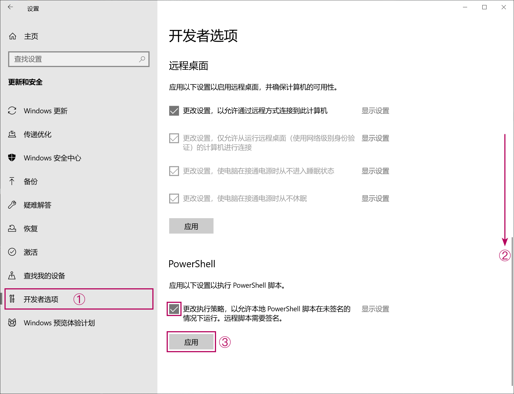

# 原创 PowerShell+CMD 多线路单文件 + 大批量压制 + 封装工具

囊括了分析，压制和封装的大型 CLI+GUI 压制辅助工具. (绝对不是因为等不来小丸工具箱更新而做的...)

## ☆环境得...

 - 有一两 ffprobe (一般下载 ffmpeg 后附带)
 - 多一斤 ffmpeg/Vapoursynth (vspipe)/Avisynth (avs2yuv)/Avisynth (avs2pipemod)
 - 含一克 x264/x265

## ★优势在...

 - 完全不依赖包括 Python 的编程语言，满足了入门视频剪辑用户一般都不会 Python 的要求
 - 自动为 ffmpeg，avs2yuv，x264，x265 填写色彩空间，位深，分辨率和帧率
 - 批量压制模式支持 15000 + 次独立的编码，每个压制的间隔都可以选择暂停和停止
 - 研发了固定 + 变化 (par-var) 的参数架构，稍加修改就可用于测试各种变量下的影响
 - 研发了编码 + 主控 (enc-ctrl) 批处理架构，解决了大批量压制下批处理结构变复杂的问题
 - 按代码要求，提供需要的信息即可，使用不需要教程
 - 由于不用编译软件，所以能直接编辑源码并测试效果
 - 压制部分支持 ffmpeg，vspipe，avs2yuv，avs2pipemod，svfi 及下游 x264，x265的 10 条线路，消灭了一大块学习成本

编码/压制工作流的线路图

 - 封装部分支持导入封装文件，特殊封装文件，视频流，音频流，字幕轨，字体轨，以及四种封装导出格式的多线并发网络

封装工作流的线路图

<del>实际没有这么复杂，但逻辑上是支持的</del>

 - 批处理能自行清理变量，不影响重复使用

-----

## ▲怎么用
 1. Windows 11 下确保安装了对应〔文件名语言〕的语言包. 如要处理阿拉伯语的文件名就去`设置 --> 时间和语言 -->[左栏] 语言 --> 添加语言 --> 阿拉伯语`. Windows10 下不需要
 2. 在设置 --> 更新和安全 --> 开发者选项中解除 PowerShell 的运行限制，如图：

 3. 解压下载好的压缩包
    - 步骤2生成待调用的编码批处理零件，由步骤3生成的主控批处理组装和调用
    - 步骤5是专门处理视频封装的批处理生成工具，可以单独拎出来用
    - 大批量和单文件模式的区别在于一个针对多集视频开发，一个用针对单视频开发
 4. 按大批量或单文件压制需求，照序号顺序右键点击"编辑"或"用PowerShell打开". 照说明文本的要求输入需要的信息，最后得到批处理

 5. 集齐压制批处理，与其对应（大批量/单文件）的主控批处理后，双击主控批处理运行即可启动压制任务

大批量模式下的批处理运行截图(早期测试)
 
 6. 最后, 运行封装用的.ps1脚本，按照提示导入构建一集视频所需的全部流/轨道，选择导出的封装格式即完成

## ★下载链接
皆同步更新, QQ群里有很高几率能得到问题答复 
1: <a href='./bbenc-source'>Github直链</a>, 
2: <a href='https://drive.google.com/drive/folders/170tmk7yJBIz5eJuy7KXzqIgtvtDajyDu?usp=sharing'>谷歌盘</a>, 
3: <a href='https://pan.baidu.com/s/1jAXn066e6K7vSfUd5zJEcg'>百度云, 提取码 hevc</a>, 
4: QQ群存档: <a href='https://jq.qq.com/?_wv=1027&k=5YJFXyf'>691892901</a> 

附录α: <a href='https://www.nazorip.site/archives/44/'>QAAC音频压缩教程</a> 或 <a href='https://github.com/iAvoe/QAAC-Tutorial-Standalone/blob/master/%E6%95%99%E7%A8%8B.md'>Github</a> 

附录β: <a href='https://nazorip.site/archives/169/'>ffprobe视频探针教程</a> 或 <a href='https://github.com/iAvoe/FFprobe-Tutorial-Standalone/blob/master/教程.md'>Github</a> 

附录γ: <a href='https://nazorip.site/archives/334/'>x264，libx264，x265，libx265，libkvazzar，OBS 急用版压制教程</a>或<a href='https://github.com/iAvoe/x264-x265-copypaste-tutorial-with-obs-record-setting/blob/master/教程.md'>Github</a> 

δ: 下载ffmpeg, ffprobe: <a href='http://ffmpeg.org/download.html'>官方</a> 或 <a href='https://ottverse.com/ffmpeg-builds'>Ottverse</a> 

ε: 下载 x264/5: <a href='http://www.mediafire.com/?6lfp2jlygogwa'>LigH (x265)</a>、
<a href='https://www.mediafire.com/?bxvu1vvld31k1'>LigH (x264)</a>、
<a href='https://github.com/jpsdr/x264/releases'>jpsdr (x264 tMod)</a>、
<a href='https://github.com/jpsdr/x265/releases'>jpsdr (x265 auto-aq Mod)</a>、
<a href='https://drive.google.com/drive/u/0/folders/0BzA4dIFteM2dWEpvWGZXV3ZhdTA'>Rigaya (x265)</a>、
<a href='https://www.mediafire.com/folder/arv5xmdqyiczc'>Patman (x264 x265)</a>、
<a href='https://github.com/DJATOM/x265-aMod/releases'>DJATOM (x265)</a>、
<a href='https://down.7086.in/'>MeteorRain/7086 (x265)</a>
  

## ☆打赏信息

"免费即最贵" 的魔咒荼毒大地，让生灵涂炭；扫描下方二维码，用大数战胜罪恶与恐惧；保卫宇宙，守护文明，创造未来，意辉孟洺，赢得世界，锚定天理，金石萃编，葱烧鲤鱼

-----

## ☆开发笔记

**IDE**
 - 使用了notepad（记事本），VSCode，PowerShell ISE完成编写。
 - 由于内容较多，所以建议用VSCode，Sublime text等自带颜色标记能力的IDE来方便修改和开发（如移植到其他编程语言）
 - 建议使用PowerShell ISE来编辑和调试

**PowerShell要求utf8+BOM文本编码**
 - 兼容PowerShell，PowerShell ISE，CMD批处理，以及UTF-8文件名4大天王之下只剩utf8+BOM这一种方案
 - PowerShell，PowerShell ISE完全不支持utf-8NoBOM
 - CMD不支持Unicode（UTF-16LE？）
 - PowerShell 5.1默认的utf-8编码选项是UTF-8BOM，且不原生支持导出UTF-8NoBOM；
 - 然而PowerShell 7要求用户用代码来运行.ps1脚本太过分，所以后期的开发完全回到PowerShell 5.1并实现了PowerShell 7中本来更容易实现的功能

**PowerShell通过循环生成多行字符串**
 - 定义序列和字符串变量: $StrArray=@(); $MtlnString=\"\"
 - 循环中往序列累计字符串值，值尾加\`n: $StrArray+=\"some text \`n\"
 - 循环跑完后直接赋值到字符串变量: [string]$MtlnString=$StrArray
 - \`n实现了换行，但从第二行开始会于开头生成多余的空格，用-replace去掉: $MtlnString=MtlnString -replace " some", "some"

**PowerShell生成自定义标题的表格**

    $新表格 = New-Object System.Data.DataTable
    $标题A= [System.Data.DataColumn]::new("自定义标题A")
    $标题B= [System.Data.DataColumn]::new("自定义标题B")
    $标题C= [System.Data.DataColumn]::new("自定义标题C")
    $新表格.Columns.Add($标题A); $新表格.Columns.Add($标题B); $新表格.Columns.Add($标题C)
    [void]$新表格.Rows.Add("行1内容A","行1内容B",$行1变量A); [void]$新表格.Rows.Add("行2内容A","行2内容B",$行2变量A)
    [void]$新表格.Rows.Add("行3内容A","行3内容B",$行3变量A); [void]$新表格.Rows.Add("行4内容A","行4内容B",$行4变量A)
    ($新表格 | Out-String).Trim() #1. Trim去掉空行, 2. pipe到Out-String以强制"$新表格"在其下方的Read-Host启动前发出

**PowerShell在列表Array中添加坍缩和不坍缩的变量**

    $列表X=@(("$不坍缩变量A$不坍缩变量B"+'$坍缩变量A'), ("$不坍缩变量C$不坍缩变量D"+'$坍缩变量B'))
    #其中双引号下的变量不会坍缩，直接得到变量值形成固定的字符串
    #二级括号用于防止PowerShell混淆 `+` 和 `, `, 否则上面整个命令只会生成一个阵列项

**PowerShell将列表Array中含坍缩变量的项扩张(expand)并打印出来**

    for ($_=0; $_ -lt $列表x.Length; $_++) {
        $ExecutionContext.InvokeCommand.ExpandString(($列表x | Out-String))
    }   #二级括号用于调整执行顺序, 即"将未扩张/Expand变量"先打印出来，然后再输入到变量扩张命令里

**PowerShell检测文件名是否符合Windows命名规则的函数**

    Function namecheck([string]$inName) {
        $badChars = '[{0}]' -f [regex]::Escape(([IO.Path]::GetInvalidFileNameChars() -join ''))
        ForEach ($_ in $badChars) {if ($_ -match $inName) {return $false}}
        return $true
    }

-----

## ★更新信息
**v1.2910**
<ul>
    <li>√ 步骤2S, 2M操作逻辑变更：删除 "temporary multiplex" 命令行生成，改为选中x265下游后生成提示</li>
    <li>√ 创建了 keyRoute 和 altRoute 的命令行储存变量：<ul>
        <li>√ 程序导入部分的循环, Switch逻辑性变更：<ul>
            <li>√ 上下游的程序导入合并到同一个循环中</li>
            <li>√ 用户现可在此循环中连续导入多个上下游程序</li>
            <li>√ 用户现可选择一条路径, 并在生成的批处理中直接从备选命令行中复制粘贴以替换选中的命令行</li>
            <li>√ 脚本会反馈一张显示了已导入程序的表格，即所有可用的上游，下游程序</li>
            <li>√ 稍微改进了罕见情况下的错误处理</li></ul>
        </li></ul>
    </li>
    <li>√ 创建了一块自动Switch代码，用于输入用户选择的路线并根据上下游每条路线，操作模式的所有限制条件自动生成主命令行 keyRoute 变量<ul>
        <li>√ 因变量在大批量模式下提前赋值而创建了 $sChar 变量的单引号坍缩和后期激活/展开的语句</li></ul>
    </li>
    <li>√ 创建了用于生成 altRoute 变量的循环:：<ul>
        <li>√ 自动根据输入的程序生成(注释掉的)所有可能的UNIX pipe命令行，从而实现方便用户快速在生成的批处理中替换主要命令行，即"地图化"的作用</li>
        <li>√ 变量 `$sChar 的坍缩 ... 同上</li></ul>
    </li>
    <li>√ 生成批处理文件的标题中，以及PS脚本完成后的请命提示添加了复制粘贴以更换线路，长期使用生成批处理的说明</li>
    <li>√ 变量 keyRoute, altRoute 的判断性执行：AVS2pipeMod上游程序的UNIX pipe格式不同</li>
    <li>√ 改良了whichlocation函数（确认路径）：打开的Windows Form窗口自动显示在最上方</li>
    <li>√ 使用新的Out-String函数解决了序列和表格无法正常显示/打印的问题<ul>
        <li>√ 通过在pipe到Out-String外添加括号，之外再套上变量扩张（Expansion）的方法解决了序列转字符串，字符串启用变量的问题</li></ul>
    </li>
    <li>√ 将所有常见的报错和崩溃判断集中到代码顶端的函数中，降低了代码管理难度</li>
    <li>√ 变量 dnPipeStr 的判断性执行："上下游命令行已知字长来判断路线是否存在"代码中, 大批量模式比单文件模式的命令字符串要长1char的模式区分</li>
    <li>√ 导出批处理的判断性执行：在大批量和单文件模式下，步骤2的文件名需要变量扩张（Expansion）才能被激活</li>
    <li>√ 测试所有代码并确认了一切正常</li>
    <li>√ 确认了步骤2的变更没有和步骤3产生逻辑或变量割裂</li>
    <li>√ 完成了整个 CHS 步骤2S --> CHS 步骤2M 的单文件代码移植</li>
    <li>√ 完成了整个 CHS 步骤2S --> ENG 步骤2S 的单文件代码移植</li>
    <li>√ 完成了整个 CHS 步骤2S --> ENG 步骤2S 的单文件翻译移植</li>
    <li>√ 完成了整个 CHS 步骤2M --> ENG 步骤2M 的单文件代码移植</li>
    <li>√ 完成了整个 CHS 步骤2M --> ENG 步骤2M 的单文件翻译移植</li>
</ul>

**v1.2380**
<ul>
    <li>完成了大量注释，请命的文本格式统一和内容优化（改动大概150行）</li>
    <li> √ 步骤2:<ul>
        <li> √ 将整个管理输出文件名的设定流程整合进函数中</li>
        <li> √ 整个批处理生成代码的Switch重构为一体</li>
        <li> √ x264下自动（通过MUXwrt变量）将临时封装输出命令行注释掉</li>
        <li> √ 淘汰了一些（因过度设计）沦为中间量，后面用不到的变量</li>
        <li> √ 增加了一批批处理内的 "REM"，以及PSScript最后部分请命信息中用于告诉用户怎么使用和再利用生成批处理的方法</li>
        <li> √ 改良并进一步统一了函数中所有警告与报错的请命内容与格式</li>
        <li> √ 逻辑性重构优化了函数，赋值，Switch，上下游路线</li></ul>
    </li>
    <li> √ 步骤3:<ul>
        <li> √ 将整个管理输出文件名的设定流程整合进函数中</li>
        <li> √ 修复: stream_tag在MOV封装文件中用途的区别导致的兼容性问题</li>
        <li> √ 加入switchOPS变量的work-around解决了函数内无法在请命中显示字符串中变量的问题</li>
        <li> √ 修复: yuva444p10le, yua444p12le的格式支持</li>
        <li> √ 修复: x264和x265的yuv-for-mpeg命令行写法的区别导致兼容性问题</li>
        <li> √ 将 "chcp 65001" 移动到批处理命令顶部（解决 "REM" 文本显示乱码的问题）</li>
        <li> √ 增加了一批输入验证，如防止 ".exe" 输入进视频源处</li>
        <li> √ 改良了几乎所有输入验证的重试请命: 删掉用于检测的变量，而是破坏DO-While循环中本应导出的变量, While部分的检测逻辑对应到破坏结果从而触发循环</li>
        <li> √ MUXops变量以及其请命文本移动到代码顶部以方便用户调整</li>
        <li> √ 重写了围绕MUXops的所有交互逻辑, 包括注释，请命和自动操作，包括自动于x264下游线路下通过MUXwrt值切换为写入注释命令模式</li>
        <li> √ 解决了输出文件名缺失的问题</li>
        <li> √ 进一步进行了大范围的变量, 代码清理，以及脚本的宏观整理</li>
        <li> √ 淘汰了一大批（因过度设计）沦为中间量，后面用不到的变量</li>
        <li> √ 增加了大量批处理内 "REM" 信息，以告诉用户怎么使用和再利用生成批处理的方法</li>
        <li> √ 改良并进一步统一了函数中所有警告与报错的请命内容与格式</li>
        <li> √ 修复了变量 impEXTs --> impEXTm 没有根据单文件/大批量模式自动切换的问题</li>
        <li> √ 修复了缺失了olsarg相关的命令行</li>
        <li> √ 启动K步骤拆分并简化（通过导出中间大量代码到函数实现）</li>
        <li> √ 逻辑性重构优化了函数，赋值，Switch，上下游路线</li></ul>
    </li>
    <li> √ 完成了整个 CHS 步骤2 单文件 --> ENG 步骤2 单文件代码移植</li>
    <li> √ 完成了整个 CHS 步骤2 单文件 --> CHS 步骤2 大批量代码移植</li>
    <li> √ 完成了整个 ENG 步骤2 大批量 --> ENG 步骤2 大批量代码移植</li>
    <li> √ 完成了整个 ENG 步骤2 单文件 --> ENG 步骤2 大批量翻译移植</li>
    <li> √ 完成了整个 CHS 步骤3 单文件 --> ENG 步骤3 单文件代码移植</li>
    <li> √ 完成了整个 CHS 步骤3 单文件 --> CHS 步骤3 大批量代码移植</li>
    <li> √ 完成了整个 ENG 步骤3 大批量 --> ENG 步骤3 大批量代码移植</li>
    <li> √ 完成了整个 ENG 步骤3 单文件 --> ENG 步骤3 大批量翻译移植</li>
    <li> √ 完成了整个 ENG 步骤2 单文件 --> ENG 步骤3 单文件翻译移植</li>
    <li> √ 完成了整个 ENG 步骤2 大批量 --> ENG 步骤3 大批量翻译移植</li>
</ul>

**v1.1840**
<ul>
    <li> √ 步骤 2:<ul>
        <li> √ 增加了跳过MKV封装后门的步骤，用于不生成MKV封装的工作流</li>
        <li> √ 修复了一些Error, Warning, Switch-Read以及更多种类交互信息中的排版</li>
        <li> √ 已完全支持SVFI</li>
        <li> √ 增加一道批处理的REM写入来解释xxxVar的作用</li></ul>
    </li>
    <li> √ 步骤 3: 去除了x265选项 --single-sei 以提高解码兼容性</li>
    <li> √ 步骤 3:更改了BDRip冷战参数以拓宽适用范围（跟随急用版教程更新）</li>
    <li> √ 步骤 1: 修复了UAC（用户账户控制）操作成功/失败检测的反馈文本含义问题</li>
    <li> √ 步骤 2-3: 改良了文件/路径选择函数: 用户点击取消/关闭时重新打开选择窗，而不是留着错误继续运行</li>
</ul>

**v1.1836**
<ul>
    <li> √ 步骤 3:<ul>
        <li> √ 修复了一处交互(prompt)文本错误</li>
        <li> √ 进行了交互文本易读性的整理和优化</li>
        <li> √ 现已支持选择[x264急用版教程](https://github.com/iAvoe/x264-x265-copypaste-tutorial-with-obs-record-setting)中的2种参数预设</li>
        <li> √ 现已支持选择[x265急用版教程](https://github.com/iAvoe/x264-x265-copypaste-tutorial-with-obs-record-setting)中的5种参数预设</li>
        <li> √ 强化了自动计算subme参数的反炒面能力（鲁棒性）</li>
        <li> √ 参数构建步骤增加了消除因空变量导致双空格的功能，虽然不影响功能</li>
        <li> √ 修复了一处未选择上游时临时ini路径变量传递断开的问题，虽然不影响功能</li>
        <li> √ 现已实现自动为x264，x265填写--keyint参数的能力，值为 ROUND(fps×9)</li></ul>
    </li>
</ul>

**v1.1789**
<ul>
    <li> √ 步骤3将x265 --subme，--pools，--frames的参数值计算/生成重写为函数代码， 降低了本体代码的复杂度，功能上不变</li>
    <li> √ 由于有人漏看了关闭PS解除运行限制的步骤，所以将其添加到了工作流的步骤中</li>
    <li> √ 步骤 1 增加了在多种情况下都应该能万无一失关闭用户账户控制的方案</li>
</ul>

**v1.1787**
<ul>
    <li> √ 步骤2排除了改进到新代码区分策略所引出的bug</li>
    <li> √ 步骤2跟进步骤3完成了对SVFI线路的支持. 理论上已经实现了单方面的完全支持</li>
    <li> √ 修复了步骤2和3的导出文件名选项中，输入文件名的提示文本没有针对单文件版定制的问题: 单文件模式下不填文件名集数变量</li>
    <li> √ 步骤3导入视频给ffprobe检测步骤中，增加了对误输入的手动拦截机制. 避免文件名太长导致没看清后缀的可能性</li>
    <li> √ 步骤3在改进到新代码区分策略的基础上完成了运行排查测试</li>
</ul>

**v1.1769**
<ul>
    <li> √ 步骤 2, 3 降低了大批量版与单文件版的代码复杂度:<ul>
        <li> √ 更改了代码区分策略 - 由注释屏蔽换成 if 区分:</li>
        <li> √ 效果包括代码更易读, 性能优化, 大批量与单文件版之间代码交叉跟进更简单等</li>
        <li> √ 进一步改良了一些字长不等处的缩进策略, 代码更整齐了</li></ul>
    </li>
    <li> × 由于代码改动范围非常大，所以可能会制造 bug</li>
    <li> ？ 步骤 3 推出了支持 SVFI 的完整 alpha 线路, 但目前需要等待SVFI支持输入视频格式, 因此无法进入beta状态<ul>
        <li> √ 完整线路: 大批量和单文件版中生成完整批处理命令行，且每次根据视频格式和上下游的各种要求进行适配的能力</li></ul>
    </li>
    <li> ？ 步骤 2 需要跟进步骤 3 完成 SVFI 线路的支持</li>
    <li> √ 步骤 3 将 y4m pipe 格式变为自动降级（换成 raw pipe）的策略, 以兼容 SVFI</li>
    <li> √ 步骤 3 增加了自动修改 SVFI 配置文件 ini 中 target_fps, 生成新文件的代码</li>
</ul>

**v1.1701**
<ul>
    <li> √ 改良了选择文件夹（路径）用窗口的配置:<ul>
        <li> √ 窗口内增加了拖拽边角放大的提示</li>
        <li> √ 增加了"新建文件夹"的按键</li>
        <li> √ 将"库"移除出了路径选择窗</li></ul>
    </li>
    <li> ？尝试增加Steam专业版SVFI上游程序失败: 仅支持输入png, jpg, tiff图片序列，而增加图片序列导入需增加一道上游pipe用于将视频解出图片序列. 据相关人员说明可能是steam版本较旧. 以后会修复</li>
    <li> √ 修复了步骤3中x264不支持--colormatrix unknown和--transfer unknown参数的问题, 需要翻译到--colormatrix undef和--transfer undef</li>
</ul>

**v1.1640**
<ul>
    <li> √ 完善了用于检测运行环境支持的步骤1:<ul>
        <li> √ 写入与编辑文件的权限检测</li>
        <li> √ PowerShell版本检测</li>
        <li> √ 计算机硬件检测</li>
        <li> √ 一般参数计算检测</li></ul>
    </li>
    <li> √ 步骤3做了一点代码优化</li>
</ul>

**v1.1632**
<ul>
    <li> √ 更正了一处函数Function的意外小写</li>
    <li> √ 全部批处理中的全部标题与命令隔行</li>
    <li> √ 全部模式下的批处理注释改成REM命令</li>
    <li> √ 因Windows 11兼容性问题，移除了批处理的&&机制</li>
    <li> √ 增加了批处理SET命令后加双引号的机制，好处是更稳定，但坏处是大批量版本循环赋值的代码变得更复杂了</li>
    <li> √ 修复了步骤3的手动输入文件名机制在步骤3上代码落后的问题</li>
    <li> √ 修复了步骤3路径搜索函数自动判断并添加"\"在部分模式下失效的问题</li>
    <li> √ 修复了步骤3路径组装步骤中多出一个双引号的问题</li>
    <li> √ 修复了步骤3单文件模式下$serial判断残留的问题</li>
</ul>

**正式 v1.1621**
<ul>
    <li> √ 步骤 3 现已可以自动填写x265的--subme参数</li>
    <li> √ 修复了步骤 3 中导出文件名的检测机制重复</li>
    <li> √ 修复了步骤 3 部分版本复制外来文件名中，提取文件名（删除路径和后缀）机制的缺失</li>
    <li> √ 改良了所有步骤的使用说明和步骤文件名</li>
</ul>

**半正式 v0.1619**
<ul>
    <li> √ 更改了自动填写--pme参数的判断，从达到12核提高到22核</li>
</ul>

**半正式 v0.1618**
<ul>
    <li> √ 修复了步骤 2 中单文件和大批量模式导入文件名交互文本太相似的问题</li>
    <li> > 增加了步骤 2, 3 文件名导入交互中的两个方括号不能紧挨的提醒</li>
</ul>
 
**内测 v0.1617**
<ul>
    <li> √ 整理了步骤 5 中所有支持媒体格式的列表</li>
</ul>

**内测 v0.1610**
<ul>
    <li> √ 增强了步骤 2，3 多个版本间的变量统一性</li>
    <li> √ 修复了步骤 2 所有版本中 Enc 和 Mux 变量赋值错误的问题</li>
    <li> √ 增强了步骤 2，3 多个版本间的文本交互信息格式，如报错从 Write-Output 改为 Write-Warning</li>
    <li> √ 增强了步骤 2 大批量和单文件版的集数累计变量的判断过程做了区分</li>
    <li> √ 增加了步骤 3 中导入空文件的报错拦截机制（虽然有些多余）</li>
    <li> √ 修复了步骤 3 中反馈文本中的一处变量拼写错误</li>
    <li> √ 修复了步骤 3 大批量版中 call 命令的序列数据叠加机制, 解决了生成命令没有换行的错误</li>
    <li> √ 强化了步骤 3 中反馈参数写入的机制</li>
    <li> √ 修复了步骤 3 大批量版中 $serial 变量被过早展开导致无法被下方集数循环迭代的问题</li>
    <li> √ 修复了步骤 3 大批量版中集数循环迭代的集数调用与三维数轴混用的错误</li>
    <li> √ 增强了步骤 3 大批量版中集数循环迭代的注释</li>
    <li> √ 修复了步骤 3 大批量版中导入路径和导入检测用视频变量混用的错误</li>
    <li> √ 删除了步骤 3 大批量版中导出批处理多出的一个 ""</li>
</ul>

**内测 v0.1570**
<ul>
    <li> √ 重新检查了全部的交互文与注释文本，进行了大量改进</li>
    <li> √ 步骤 5 增加了 alac 支持, 以及对应的封装格式支持范围提醒</li>
    <li> √ 步骤 5 增加了 flac 支持, 以及对应的封装格式支持范围提醒</li>
    <li> √ 步骤 5 增加了 ape"支持"(由于没有封装文件支持, 所以增加了报错拦截机制)</li>
    <li> √ 步骤 5 增加了 vp9 支持, 以及对应的封装格式支持范围提醒</li>
    <li> √ 步骤 5 增加了 apcn/ap4x 的封装格式支持范围提醒</li>
    <li> √ 步骤 5 增加了 ass/ssa 的封装格式支持范围提醒</li>
    <li> √ 步骤 5 增加了 MXF 封装格式以及对应的字体文件导入命令拦截</li>
    <li> √ 大批量版，单文件版步骤 2 整理了注释和用户交互 CLI 文本</li>
    <li> √ 大批量版步骤 2 完成了英文版的翻译</li>
    <li> √ 单文件版步骤 2 完成了英文版的翻译</li>
    <li> √ 大批量版步骤 3 完成了英文版的翻译</li>
    <li> √ 单文件版步骤 3 完成了英文版的翻译</li>
    <li> √ 单文件版步骤 5 完成了英文版的翻译</li>
    <li> √ 步骤 5 修复了一处 Switch 判断 bug</li>
</ul>

**内测 v0.1151**
<ul>
    <li> √ 大批量版压制批处理生成步骤缩减了 50 行左右的代码, 并且减少了 x264 线路下用户交互的数量</li>
    <li> √ 单文件版压制批处理生成步骤缩减了 25 行左右的代码, 并且减少了 x264 线路下用户交互的数量</li>
    <li> √ 大批量版，单文件版压制批处理更兼容新版步骤 3 了</li>
</ul>

**内测 v0.1120**
<ul>
    <li>√ 大批量版主控（步骤 3）给出了按照步骤 2 所给予的数量生成 x264, x265, ffmpeg, avs2yuv, vspipe, avs2pipemod 压制参数的方案</li>
    <li> √ 大批量版主控（步骤 3）给出了三种不同的文件名赋值来源，用户端更方便了</li>
    <li> √ 大批量版和单文件版步骤 2, 3 的 x264 线路已经添加并测试了，虽然可能还有 bug</li>
    <li> √ 步骤 2, 3 均进行了大量逻辑升级和小步骤代码重构，整合，冗余，精简，微调，上下文逻辑改良</li>
</ul>

**内测 v0.390**
<ul>
    <li> √ 修复了一堆 bug</li>
    <li> √ 优化了 x264 的编码线路</li>
    <li> √ 重构了了压制导出文件名，以及生成临时封装文件名的方案（大批量版默认用导入文件名 + 序号，单文件版默认用导入文件名）</li>
    <li> √ 根据 x264 的支持重排了 x264 线路下色彩空间变量的赋值流程</li>
    <li> √ 完成了 x264 步骤 2 的大批量模式脚本</li>
    <li> √ x264 编码线路的所有步骤完成了测试阶段</li>
    <li> √ 优化了 avs2yuv，avs2pipemod 的线路</li>
    <li> √ x265 的大批量编码步骤 2 能够生成临时 MP4 封装了. 由于是批量生成所以原理和单文件版不同</li>
</ul>

**内测 v0.330**
<ul>
    <li> √ 自动填写 x265 的 --pools 参数</li>
    <li> √ 增加了 x264 的编码线路</li>
    <li> √ 自动填写 ffmpeg 的 - r 参数</li>
    <li> √ 步骤 2 和 3 的单文件模式增加了 ffmpegParB 和临时封装成 MP4 的步骤, 以兼容 ffmpeg 不让封装单文件视频流到 MKV 的限制</li>
    <li> √ 增加了生成单文件封装命令的 PowerShell 脚本: 步骤 5</li>
    <li> √ 步骤 5 实现了自动根据判断多种不兼容参数, 不兼容流, 不兼容封装格式来提醒 / 警告, 以及生成和调整封装命令的能力</li>
    <li> √ 步骤 5 经过一些测试后解决了 ffmpeg 刁钻的命令书写顺序问题</li>
    <li> √ 步骤 5 支持在元数据 codec_tag_string 被删除的情况下自动切换到 codec_name</li>
    <li> √ 步骤 5 的代码复杂度超过了之前所有步骤的集合</li>
    <li> √ 选择封装改到靠后的代码部分</li>
</ul>

**内测 v0.190**
<ul>
    <li> √ 步骤 2 添加 avs2pipemod</li>
    <li> √ 合并了步骤 2 的 4 条线路（ffmpeg, VapourSynth, avs2yuv, avs2pipemod）</li>
    <li> √ 步骤 2 的循环方式得到改良, 支持生成 17576 个独立的编码任务</li>
    <li> √ 步骤 2, 步骤 3 根据不同的上游程序改写了 pipe 格式</li>
</ul>

**内测 v0.180**
<ul>
    <li> √ 步骤 3 增加了 avs2pipemod 的支持,</li>
    <li> √ 步骤 3 从 4 个文件合并为 1 个文件, 降低了开发难度, </li>
    <li> √ 自动填写 --pme 参数, </li>
    <li> √ 自动填写 avs2yuv 的色彩空间, 分辨率参数,</li>
    <li> √ 增加 nv12, nv16 色彩空间在 avs2yuv, avs2pipemod 下的警告, </li>
    <li> √ 升级了路径验证 (根目录下有, 但非根目录下没有), </li>
    <li> √ 区分了 4 条线路 + 两种版本下输出主控文件的文件名</li>
</ul>

**更早**
<ul>
    <li>√ 实现了自动填写 --input-res，--colormatrix，--transfer，--fps，-D，-pix_fmt 参数</li>
    <li> √ 在 powershell 5 里实现了 powershell 7 输出 UTF-8 NO BOM 的功能, 因为下载 powershell 7 后用的还是 powershell 5, 右键菜单更改不了</li>
    <li> √ 增加了多台电脑如何分割多集进行编码的说明</li>
    <li> √ 实现了高 DPI 渲染下的 Windows Forms（选择文件 / 路径用的窗口）</li>
</ul>
