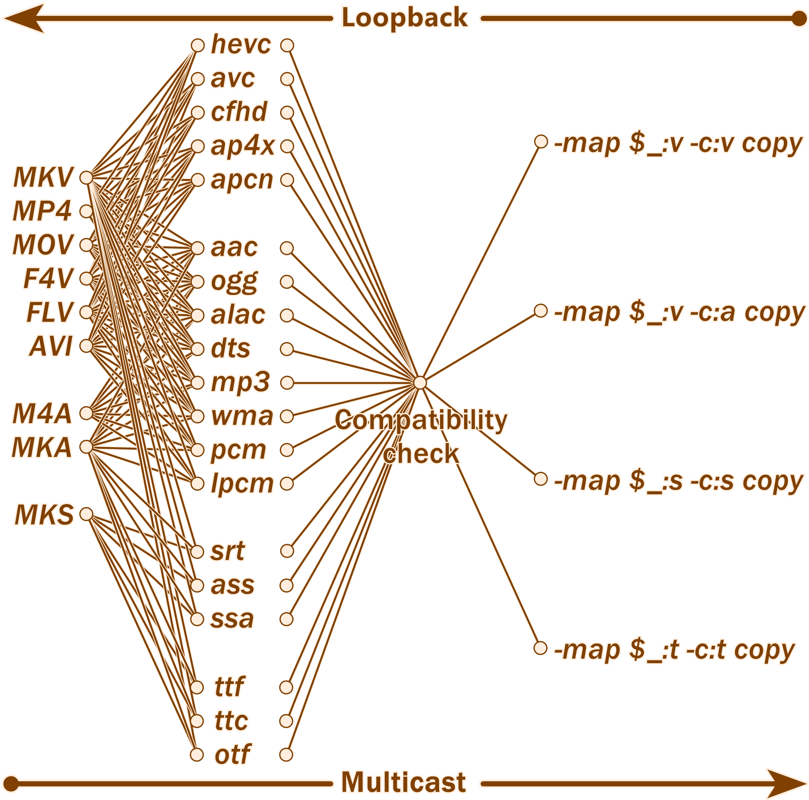

# 原创 PowerShell+CMD 多线路单文件 + 大批量压制 + 封装工具

囊括了分析，压制和封装的大型 CLI+GUI 压制辅助工具. (绝对不是因为等不来小丸工具箱更新而做的...)

## ☆环境得...

 - 有一两 ffprobe (一般下载 ffmpeg 后附带)
 - 多一斤 ffmpeg/Vapoursynth (vspipe)/Avisynth (avs2yuv)/Avisynth (avs2pipemod)
 - 含一克 x264/x265

## ★优势在...

 - 完全不依赖包括 Python 的编程语言，满足了入门视频剪辑用户一般都不会 Python 的要求
 - 按代码要求，提供需要的信息即可，使用不需要教程
 - 由于不用编译软件，所以能直接编辑源码并测试效果
 - 压制部分支持 ffmpeg，vspipe，avs2yuv，avs2pipemod 及下游 x264，x265 的 8 条线路，消灭了一大块学习成本

编码/压制工作流的线路图

 - 封装部分支持导入封装文件，特殊封装文件，视频流，音频流，字幕轨，字体轨，以及四种封装导出格式的多线并发网络

封装工作流的线路图

<del>实际没有这么复杂，但逻辑上是支持的</del>

 - 自动为 ffmpeg，avs2yuv，x264，x265 填写色彩空间，位深，分辨率和帧率
 - 批量压制模式支持 15000 + 次独立的编码，每个压制的间隔都可以选择暂停和停止
 - 研发了固定 + 变化 (par-var) 的参数架构，稍加修改就可用于测试各种变量下的影响
 - 研发了编码 + 主控 (enc-ctrl) 批处理架构，解决了大批量压制下批处理结构变复杂的问题
 - 批处理能自行清理变量，不影响重复使用

-----

## ▲怎么用

 1. 解压下载好的压缩包
    - 步骤2生成待调用的编码批处理零件，由步骤3生成的主控批处理组装和调用
    - 步骤5是专门处理视频封装的批处理生成工具，可以单独拎出来用
    - 大批量和单文件模式的区别在于一个针对多集视频开发，一个用针对单视频开发
 2. 按大批量或单文件压制需求，照序号顺序右键点击"编辑"或"用PowerShell打开". 照说明文本的要求输入需要的信息，最后得到批处理

 3. 集齐压制批处理，与其对应（大批量/单文件）的主控批处理后，双击主控批处理运行即可启动压制任务

大批量模式下的批处理运行截图(早期测试)
 
 4. 最后, 运行封装用的.ps1脚本，按照提示导入构建一集视频所需的全部流/轨道，选择导出的封装格式即完成

## ★下载链接
皆同步更新, QQ群里有很高几率能得到问题答复 
1: <a href='./bbenc-source'>Github直链</a>, 
2: <a href='https://drive.google.com/drive/folders/170tmk7yJBIz5eJuy7KXzqIgtvtDajyDu?usp=sharing'>谷歌盘</a>, 
3: <a href='https://pan.baidu.com/s/1jAXn066e6K7vSfUd5zJEcg'>百度云, 提取码 hevc</a>, 
4: QQ群存档: <a href='https://jq.qq.com/?_wv=1027&k=5YJFXyf'>691892901</a> 

附录α: <a href='https://www.nazorip.site/archives/44/'>QAAC音频压缩教程</a>或<a href='https://github.com/iAvoe/QAAC-Tutorial-Standalone/blob/master/%E6%95%99%E7%A8%8B.md'>Github</a> 

附录β: <a href='https://nazorip.site/archives/169/'>ffprobe视频探针教程</a>或<a href='https://github.com/iAvoe/FFprobe-Tutorial-Standalone/blob/master/教程.md'>Github</a> 

附录γ: <a href='https://nazorip.site/archives/334/'>x264，libx264，x265，libx265，libkvazzar，OBS 急用版压制教程</a>或<a href='https://github.com/iAvoe/x264-x265-copypaste-tutorial-with-obs-record-setting/blob/master/教程.md'>Github</a> 

δ: 下载ffmpeg, ffprobe: <a href='http://ffmpeg.org/download.html'>官方</a>或<a href='https://ottverse.com/ffmpeg-builds'>Ottverse</a> 

ε: 下载 x264/5: <a href='http://www.mediafire.com/?6lfp2jlygogwa'>LigH (x265)</a>、
<a href='https://www.mediafire.com/?bxvu1vvld31k1'>LigH (x264)</a>、
<a href='https://drive.google.com/drive/u/0/folders/0BzA4dIFteM2dWEpvWGZXV3ZhdTA'>Rigaya (x265)</a>、
<a href='https://www.mediafire.com/folder/arv5xmdqyiczc'>Patman (x264 x265)</a>、
<a href='https://github.com/DJATOM/x265-aMod/releases'>DJATOM (x265)</a>、
<a href='https://down.7086.in/'>MeteorRain/7086 (x265)</a>
  

## ☆打赏信息

"免费即最贵" 的魔咒荼毒大地，让生灵涂炭；扫描下方二维码，用大数战胜罪恶与恐惧；保卫宇宙，守护文明，创造未来，意辉孟洺，赢得世界，锚定天理，金石萃编，葱烧鲤鱼

-----

## ☆开发笔记

**IDE**
 - 使用了notepad（记事本），VSCode，PowerShell ISE完成编写。
 - 由于内容较多，所以建议用VSCode，Sublime text等自带颜色标记能力的IDE来方便修改和开发（如移植到其他编程语言）
 - 建议使用PowerShell ISE来编辑和调试

**PowerShell要求utf8+BOM文本编码**
 - 兼容PowerShell，PowerShell ISE，CMD批处理，以及UTF-8文件名4大天王之下只剩utf8+BOM这一种方案
 - PowerShell，PowerShell ISE完全不支持utf-8NoBOM
 - CMD不支持Unicode（UTF-16LE？）
 - PowerShell 5.1默认的utf-8编码选项是UTF-8BOM，且不原生支持导出UTF-8NoBOM；
 - 然而PowerShell 7要求用户用代码来运行.ps1脚本太过分，所以后期的开发完全回到PowerShell 5.1并实现了PowerShell 7中本来更容易实现的功能

**PowerShell通过循环生成多行字符串**
 - 定义序列和字符串变量: $StrArray=@(); $MtlnString=\"\"
 - 循环中往序列累计字符串值，值尾加\`n: $StrArray+=\"some text \`n\"
 - 循环跑完后直接赋值到字符串变量: [string]$MtlnString=$StrArray
 - \`n实现了换行，但从第二行开始会于开头生成多余的空格，用-replace去掉: $MtlnString=MtlnString -replace " some", "some"

-----

## ☆代价是...

 - 献祭了寒假，维持了几十个添加功能 --> 新功能制造 bug --> debug 的循环，以及扩充新线路所需的另存在新版本 --> 修改线路 --> 写注释 --> debug --> 合并到原版 --> 区分变量 --> debug 的循环
 - 代码的运行逻辑比一般的压制软件复杂，为了兼容不同程序的命令排版格式而使用了很多变量来分割与重构命令行
 - 由于要在系统预装的 PowerShell 5.1 或 CMD 中输入命令才能打开下载的 PowerShell 7（用户门槛太高），所以不得已只能在 PowerShell 5.1 中实现一些 PowerShell 7 的原生功能
 - 为了支持 15000 + 趟批处理编码而研发了 26 个英文字母实现的 26 进制 for 循环
 - 为了保证绝大多数媒体格式的兼容性，debug 了几十小时后整出了 168 行的大型 function
 - 据组长所言，未来可预见维护会变得困难

**★为何不用 C++，TypeScript，JS**
 - 没学过 =_=，而且装上环境对系统的变更太多了，卸载肯定会有残留（？）；现成的PowerShell就能用

**☆装个 Python 怎么会劝退用户**
装 Python 不难，但:
 - Atom 用的人少所以下载不好找（？）
 - Python 不自带 IDE（调试器）
 - VSCode 要调的设置太多太细，而且是不是弹信息和警告很烦人（虽然我自己用习惯了）
 - np++ 和 Vim 一个香蕉一个把用户往死里折腾
 - Sublime 要付费或者找第三方破解

总之在编辑调试器这一点上如果没有开发调试 Python 的需求，确实会浪费时间精力；反过来系统自带的 PowerShell ISE 在性能，易用性，需要专门设置，学习上手的项目少，更适合一般用户

## ★更新信息
**半正式 v0.1619**
<ul>
    <li> √ 更改了自动填写--pme参数的判断，从达到12核提高到22核</li>
</ul>

**半正式 v0.1618**
<ul>
    <li> √ 修复了步骤 2 中单文件和大批量模式导入文件名交互文本太相似的问题</li>
    <li> > 增加了步骤 2, 3 文件名导入交互中的两个方括号不能紧挨的提醒</li>
</ul>
 
**内测 v0.1617**
<ul>
    <li> √ 整理了步骤 5 中所有支持媒体格式的列表</li>
</ul>

**内测 v0.1610**
<ul>
    <li> √ 增强了步骤 2，3 多个版本间的变量统一性</li>
    <li> √ 修复了步骤 2 所有版本中 Enc 和 Mux 变量赋值错误的问题</li>
    <li> √ 增强了步骤 2，3 多个版本间的文本交互信息格式，如报错从 Write-Output 改为 Write-Warning</li>
    <li> √ 增强了步骤 2 大批量和单文件版的集数累计变量的判断过程做了区分</li>
    <li> √ 增加了步骤 3 中导入空文件的报错拦截机制（虽然有些多余）</li>
    <li> √ 修复了步骤 3 中反馈文本中的一处变量拼写错误</li>
    <li> √ 修复了步骤 3 大批量版中 call 命令的序列数据叠加机制, 解决了生成命令没有换行的错误</li>
    <li> √ 强化了步骤 3 中反馈参数写入的机制</li>
    <li> √ 修复了步骤 3 大批量版中 $serial 变量被过早展开导致无法被下方集数循环迭代的问题</li>
    <li> √ 修复了步骤 3 大批量版中集数循环迭代的集数调用与三维数轴混用的错误</li>
    <li> √ 增强了步骤 3 大批量版中集数循环迭代的注释</li>
    <li> √ 修复了步骤 3 大批量版中导入路径和导入检测用视频变量混用的错误</li>
    <li> √ 删除了步骤 3 大批量版中导出批处理多出的一个 ""</li>
</ul>

**内测 v0.1570**
<ul>
    <li> √ 重新检查了全部的交互文与注释文本，进行了大量改进</li>
    <li> √ 步骤 5 增加了 alac 支持, 以及对应的封装格式支持范围提醒</li>
    <li> √ 步骤 5 增加了 flac 支持, 以及对应的封装格式支持范围提醒</li>
    <li> √ 步骤 5 增加了 ape"支持"(由于没有封装文件支持, 所以增加了报错拦截机制)</li>
    <li> √ 步骤 5 增加了 vp9 支持, 以及对应的封装格式支持范围提醒</li>
    <li> √ 步骤 5 增加了 apcn/ap4x 的封装格式支持范围提醒</li>
    <li> √ 步骤 5 增加了 ass/ssa 的封装格式支持范围提醒</li>
    <li> √ 步骤 5 增加了 MXF 封装格式以及对应的字体文件导入命令拦截</li>
    <li> √ 大批量版，单文件版步骤 2 整理了注释和用户交互 CLI 文本</li>
    <li> √ 大批量版步骤 2 完成了英文版的翻译</li>
    <li> √ 单文件版步骤 2 完成了英文版的翻译</li>
    <li> √ 大批量版步骤 3 完成了英文版的翻译</li>
    <li> √ 单文件版步骤 3 完成了英文版的翻译</li>
    <li> √ 单文件版步骤 5 完成了英文版的翻译</li>
    <li> √ 步骤 5 修复了一处 Switch 判断 bug</li>
</ul>

**内测 v0.1151**
<ul>
    <li> √ 大批量版压制批处理生成步骤缩减了 50 行左右的代码, 并且减少了 x264 线路下用户交互的数量</li>
    <li> √ 单文件版压制批处理生成步骤缩减了 25 行左右的代码, 并且减少了 x264 线路下用户交互的数量</li>
    <li> √ 大批量版，单文件版压制批处理更兼容新版步骤 3 了</li>
</ul>

**内测 v0.1120**
<ul>
    <li>√ 大批量版主控（步骤 3）给出了按照步骤 2 所给予的数量生成 x264, x265, ffmpeg, avs2yuv, vspipe, avs2pipemod 压制参数的方案</li>
    <li> √ 大批量版主控（步骤 3）给出了三种不同的文件名赋值来源，用户端更方便了</li>
    <li> √ 大批量版和单文件版步骤 2, 3 的 x264 线路已经添加并测试了，虽然可能还有 bug</li>
    <li> √ 步骤 2, 3 均进行了大量逻辑升级和小步骤代码重构，整合，冗余，精简，微调，上下文逻辑改良</li>
</ul>

**内测 v0.390**
<ul>
    <li> √ 修复了一堆 bug</li>
    <li> √ 优化了 x264 的编码线路</li>
    <li> √ 重构了了压制导出文件名，以及生成临时封装文件名的方案（大批量版默认用导入文件名 + 序号，单文件版默认用导入文件名）</li>
    <li> √ 根据 x264 的支持重排了 x264 线路下色彩空间变量的赋值流程</li>
    <li> √ 完成了 x264 步骤 2 的大批量模式脚本</li>
    <li> √ x264 编码线路的所有步骤完成了测试阶段</li>
    <li> √ 优化了 avs2yuv，avs2pipemod 的线路</li>
    <li> √ x265 的大批量编码步骤 2 能够生成临时 MP4 封装了. 由于是批量生成所以原理和单文件版不同</li>
</ul>

**内测 v0.330**
<ul>
    <li> √ 自动填写 x265 的 --pools 参数</li>
    <li> √ 增加了 x264 的编码线路</li>
    <li> √ 自动填写 ffmpeg 的 - r 参数</li>
    <li> √ 步骤 2 和 3 的单文件模式增加了 ffmpegParB 和临时封装成 MP4 的步骤, 以兼容 ffmpeg 不让封装单文件视频流到 MKV 的限制</li>
    <li> √ 增加了生成单文件封装命令的 PowerShell 脚本: 步骤 5</li>
    <li> √ 步骤 5 实现了自动根据判断多种不兼容参数, 不兼容流, 不兼容封装格式来提醒 / 警告, 以及生成和调整封装命令的能力</li>
    <li> √ 步骤 5 经过一些测试后解决了 ffmpeg 刁钻的命令书写顺序问题</li>
    <li> √ 步骤 5 支持在元数据 codec_tag_string 被删除的情况下自动切换到 codec_name</li>
    <li> √ 步骤 5 的代码复杂度超过了之前所有步骤的集合</li>
    <li> √ 选择封装改到靠后的代码部分</li>
</ul>

**内测 v0.190**
<ul>
    <li> √ 步骤 2 添加 avs2pipemod</li>
    <li> √ 合并了步骤 2 的 4 条线路（ffmpeg, VapourSynth, avs2yuv, avs2pipemod）</li>
    <li> √ 步骤 2 的循环方式得到改良, 支持生成 17576 个独立的编码任务</li>
    <li> √ 步骤 2, 步骤 3 根据不同的上游程序改写了 pipe 格式</li>
</ul>

**内测 v0.180**
<ul>
    <li> √ 步骤 3 增加了 avs2pipemod 的支持,</li>
    <li> √ 步骤 3 从 4 个文件合并为 1 个文件, 降低了开发难度, </li>
    <li> √ 自动填写 --pme 参数, </li>
    <li> √ 自动填写 avs2yuv 的色彩空间, 分辨率参数,</li>
    <li> √ 增加 nv12, nv16 色彩空间在 avs2yuv, avs2pipemod 下的警告, </li>
    <li> √ 升级了路径验证 (根目录下有, 但非根目录下没有), </li>
    <li> √ 区分了 4 条线路 + 两种版本下输出主控文件的文件名</li>
</ul>

**更早**
<ul>
    <li>√ 实现了自动填写 --input-res，--colormatrix，--transfer，--fps，-D，-pix_fmt 参数</li>
    <li> √ 在 powershell 5 里实现了 powershell 7 输出 UTF-8 NO BOM 的功能, 因为下载 powershell 7 后用的还是 powershell 5, 右键菜单更改不了</li>
    <li> √ 增加了多台电脑如何分割多集进行编码的说明</li>
    <li> √ 实现了高 DPI 渲染下的 Windows Forms（选择文件 / 路径用的窗口）</li>
</ul>
