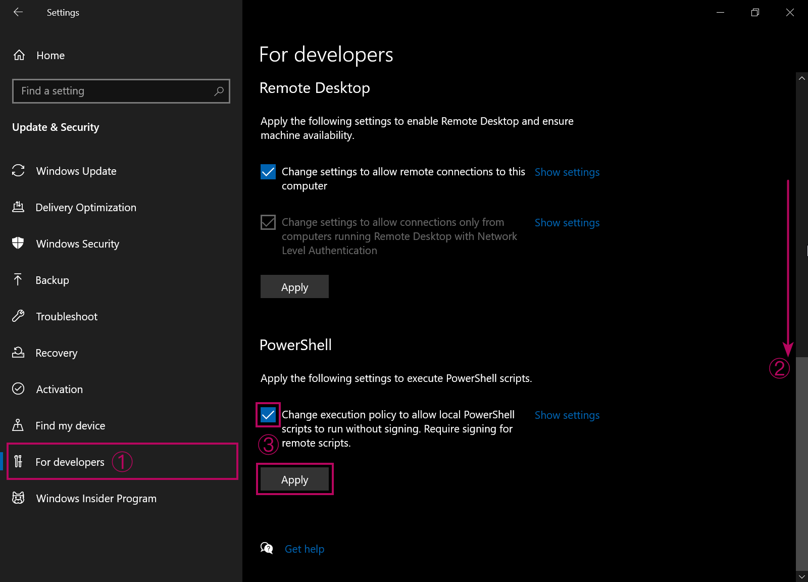
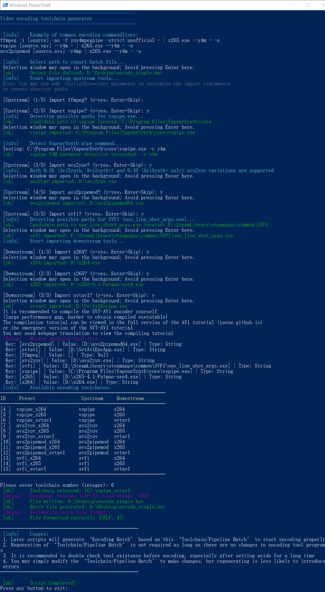

# Batch Batch Encoder

This tool analyzes source video to perform actual customized video encoding solutions. It automates tedious format alignment, simplifies operations, and starts your encoding ASAP.

## Environment

**Supported Upstream Programs**:
- ffmpeg
- vspipe (supports automatic parameter API recognition)
- avs2yuv
- avs2pipemod
- SVFI

**Supported Downstream Programs**:
- x264
- x265
- SVT-AV1

Only one upstream and one downstream program are needed on the system.

## Advantages

- [x] Graphical + Command-line Interactive Interface:
    - High-DPI WinForm selection window when selecting files or paths
    - Color-coded hints + pure selection interaction logic (prompt) on basic command-line options
- [x] Automatic generation of filter-free VS/AVS scripts: Accelerates script building or directly launches upstream tools such as vspipe, avs2yuv, and avs2pipemod
- [x] Independently packaged command scripts: Import video streams, audio streams, subtitle tracks, and fonts
- [x] Deeply customized encoding parameters: Automatic calculation + user-defined encoder configuration to meet your needs as much as possible
- [x] Quick command-line changes: In the generated batch, you can directly replace previously imported upstream and downstream tools by copying and pasting; easily generate multiple processing sources and video formats.

-----

## Usage

If you need to ensure security, you can verify it using Microsoft's official PSScriptAnalyzer tool: [PSScriptAnalyzer](https://learn.microsoft.com/en-us/powershell/utility-modules/psscriptanalyzer/overview?view=ps-modules).
```
Invoke-ScriptAnalyzer -Path "X:\...\Batch-batch-encoder\bbenc-source" -Settings PSGallery -Recurse
```

1. For Windows 11, ensure the language pack for the corresponding filename language is installed (Windows 10).
    1. For example, Arabic filenames: `Settings → Time & Language → [Left Column] Language → Add a language → Arabic`
2. In Settings → Update & Security → Developer options, remove the PowerShell execution restriction, as shown in the image:

3. Unzip the downloaded compressed file.
4. Run step 1 to complete the basic environment check.
    1. If VSCode is installed, it is recommended to directly install the Microsoft PowerShell plugin to run it.
    2. In VSCode, select `File → Open Folder → Open Script Root Directory (...\bbenc-source\ZH v1.x\)`
    3. VSCode requires confirmation of "Trust Publisher" before running the script.
5. Run steps 2 (Generate Coding Pipeline Batch), 3 (ffprobe Reads Source), and 4 (Generate Coding Tasks).
6. Run step 4. The generated batch file begins encoding.
    1. If multiple formats are required, simply remove the comments from the alternative parameters.
7. Run step 5 to encapsulate the encoding results.


<p align="center">Example fur running step 2 (CLI window only, this works even better in VSCode)</p>

-----

## Downloads
1. <a href='./bbenc-source'>On Github</a>
2. <a href='https://drive.google.com/drive/folders/170tmk7yJBIz5eJuy7KXzqIgtvtDajyDu?usp=sharing'>Google Drive</a>,

## Caveat

The import commands for generating alternative routes are ultimatly using a single source, it can be video, `.vpy` or `.avs`. Therefore, input/import arguments/parameters for backup pipe upstream program, depending on user selection, might be written with unwanted files, despite will correct formatting. Manual batch editing when switching routes is needed.

## Support pls

Developing these tools wasn't easy. If this tool improve your efficiency, consider sponsoring or sharing them.

<p align="center"><br></p>

## Update Information
**v1.4.7**
- Added sample aspect ratio (SAR) detection and warnings
  - Added examples of tools such as ffmpeg for writing SAR metadata
- Fixed a bug where a null file was generated in the running directory after step 3 was executed.

**v1.4.6**
- Performed major code cleanup and prettifying on top of 1.4.5

**v1.4.5**
- Implemented VOB format metadata processing
- Implemented progressive and interlaced format processing for VOB and non-VOB formats
- Implemented encoding and IO parameters for avs2pipemod, x264, and x265 on interlaced sources
  - (SVT-AV1 will indicate incompatibility).
- Completed testing of vspipe to x264 & x265, avs2yuv to x264 & x265, avs2pipemod to x264 & x265 on VOB and normal formats, as well as interlaced sources
- Fixed a logic issue where only .avs or .vpy files could be imported when both AVS-like tools and vspipe were selected upstream, triggering a compatibility check failure (determining the script should be terminated). (Modifying the script source file extension and checking file existence resulted in an error message, but the error was ignored.)
- Step 3 has been upgraded to use ffprobe to detect the actual package file format, no longer relying on file extension detection.
- Step 2 has added the ability to automatically select the toolchain when only one is available

**v1.3.9**
- Brought variable cleanup (endlocal) forward, so CMD window can be closed cleanly right after encoding session
- Added explanations for why not implementing reading video sources, or verifying video existence from .vs and .avs scripts

**v1.3.8**
- SVFI adaptation achieved
  - Automatic retrieval of Task ID and source video path (JSON parsed) from the rendering configuration INI
  - Automatic construction of pipeline parameters, thus skipping the video import step.
- Fixed a flaw in SVT-AV1 parameter construction
- Added auto path detection for one_line_shot_args.exe and vspipe.exe (simplified tool import process)

**v1.3.7**
- Rewrote entire codebase
- Used more reasonable data structures such as arrays and hash tables
- Improved error reporting logic
- Further improved support for square bracket paths and filenames
- Built a global script, simplifying the code
- Abandoned the batch mode
- Added basic SVT-AV1 support
- Rewrote all parameter calculation functions into functions, improving modularity
- Added color-coded prompt text, unifying the appearance
- Improved vspipe support
- Improved SVFI support
- Added automatic VS and AVS filterless script generation function
- Centralized export of cached datasets to a single folder
- Avoided step 4 by appending an additional CSV Repeated script imports avoid ffprobe CSV export compatibility issues.
- Improved the operation logic of step 1.
- Improved Y4M pipeline support.
- Refined the operation logic and process of the encapsulation command.
- Added more optimization-related prompt text.
- Strengthened the logic of the file import script.
- Behavior change: Required parameters for the RAW pipeline are now recorded as an appendix in the output batch.
- Added SVT-AV1 ColorMatrix, Transfer, and Primarys parameter generation functionality.
- Verified: ffmpeg supported
- Verified: vspipe supported
- Verified: avs2yuv (0.26+0.30) supported
- Verified: avs2pipemod supported
- Step 5 (multiplex script) rewrite ompleted, deprecating all Invoke-Expression to increase security