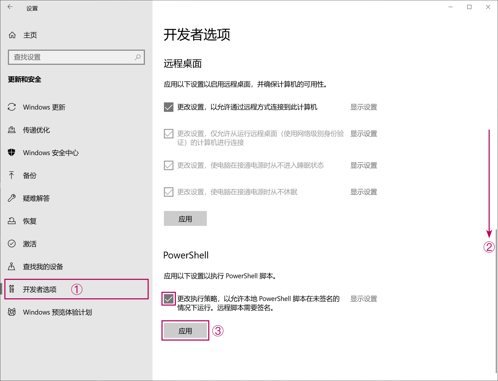
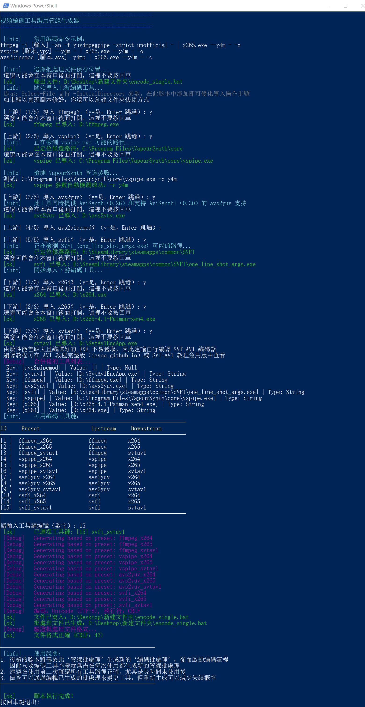

# PowerShell 批處理自定義參數壓制工具

為提高編碼參數配置階段效率而開發的軟件規格腳本，用於構建多種視頻編碼壓制任務。邏輯上根據視頻源屬性，用戶需求，引用各個程序的命令行格式等規則為前提，構建上游僅 Y4M 管道導出 + 下游深度定制參數的效率提升工具，實現了急用版壓制教程的上位替代。

## 環境

**支持的管道上游程序**：
- ffmpeg
- vspipe（支持 API 3.0、4.0 自動識別）
- avs2yuv
- avs2pipemod
- SVFI

**支持的管道下游程序**：
- x264
- x265
- SVT-AV1

只要系統裡有一個上游、一個下游程序即可。

## 優點

- [x] 圖形 + 命令行交互界面：
  - 在選擇文件、路徑時調用高 DPI 模式的 Win Form 選窗
  - 在基本命令行選項上使用分色編碼提示 + 純選擇交互邏輯（prompt）
- [x] 自動生成無濾鏡 VS/AVS 腳本：加速完成腳本構建，或直接啟動 vspipe、avs2yuv、avs2pipemod 上游
- [x] 獨立封裝命令腳本：導入視頻流，音頻流，字幕軌，字體
- [x] 深度定制編碼參數：自動計算 + 用戶定義實現盡可能符合需求的編碼器配置
- [x] 快速命令行變更：在生成的批處理中，可以直接通過復制粘貼來替換先前導入的管道上游、下游工具；輕松衍生多種處理源與視頻格式

-----

## 用法

如需確保安全性，則可以通過微軟官方的 [PSScriptAnalyzer](https://learn.microsoft.com/en-us/powershell/utility-modules/psscriptanalyzer/overview?view=ps-modules) 檢測工具來驗證：
```
Invoke-ScriptAnalyzer -Path "X:\...\Batch-batch-encoder\bbenc-source" -Settings PSGallery -Recurse
```

1. Windows 11 下需要確保安裝了對應文件名語言的語言包（Windows 10）
    1. 例如，阿拉伯語文件名：`設置 → 時間和語言 →[左欄] 語言 → 添加語言 → 阿拉伯語`
2. 在設置 → 更新和安全 → 開發者選項中解除 PowerShell 的運行限制，如圖：

3. 解壓下載好的壓縮包
4. 運行步驟 1 從而完成基本環境檢測
    1. 如果安裝了 VSCode，則建議直接安裝微軟 PowerShell 插件運行
    2. VSCode 選擇 `文件 → 打開文件夾 → 打開腳本根目錄（...\bbenc-source\ZH v1.x\）`
    3. VSCode 需要確認「信任發布者」才能運行腳本
5. 運行步驟 2（生成編碼管線批處理）、3（ffprobe 讀取源）、4（生成編碼任務）
6. 運行步驟 4 生成的批處理以開始編碼
    1. 若有多種格式的需求，去除備用參數的注釋即可
7. 運行步驟 5 以封裝編碼結果


<p align="center">腳本步驟 2 示例（僅 CLI 窗口，在 VSCode 中運行效果最佳）</p>

## 下載鏈接

皆同步更新，QQ 群裡有很高幾率能得到問題答復

1. <a href='https://github.com/iAvoe/Batch-batch-encoder/tree/main/bbenc-source'>Github 直鏈</a>, 
2. <a href='https://drive.google.com/drive/folders/170tmk7yJBIz5eJuy7KXzqIgtvtDajyDu?usp=sharing'>谷歌盤</a>, 
3. <a href='https://pan.baidu.com/s/1jAXn066e6K7vSfUd5zJEcg'>百度雲，提取碼 hevc</a>, 
4. QQ 群存檔：<a href='https://jq.qq.com/?_wv=1027&k=5YJFXyf'>691892901</a><br>

教程地圖、工具下載見：<a href="https://iavoe.github.io/">iavoe.github.io</a>

## 缺陷信息

用於生成備用管線（pipe 命令行）的導入命令最終都使用單一源文件，這可能是視頻、.vpy 或 .avs 文件。因此，根據選擇的管道上游程序不同，備用命令行中的上游程序輸入/導入參數可能會寫作指定導入無效的文件。於是盡管格式正確，切換命令時仍可能需要手動編輯批處理。

## 打賞信息

開發這些工具並不容易。如果這套工具提高了你的效率，那麼不妨贊助或推廣一下下下。

<p align="center"><br></p>

## 更新信息
**v1.4.7**
- 新增了變寬比（SAR）偵測與警告
  - 添加了寫入 SAR 元數據的 ffmpeg 等工具範例
- 修復了步驟 3 運行後在運行目錄產生 null 空文件的故障

**v1.4.6**
- 在 1.4.5 基礎上進行了代碼清理和美化

**v1.4.5**
- 實現了 VOB 格式的元數據讀取支持
- 實現了 VOB 與非 VOB 的逐行與隔行掃描識別功能
- 添加了自動指定 avs2pipemod、x264、x265 隔行掃描參數的功能（SVT-AV1 則提示原生不支持）
- 已完成對 VOB 和普通格式以及隔行掃描源的 vspipe 到 x264 和 x265、avs2yuv 到 x264 和 x265、avs2pipemod 到 x264 和 x265 的測試
- 修復了因管道上游同時選擇了 AVS 類工具以及 vspipe 工具時，只能導入 .avs 或 .vpy 觸發相容檢測失敗（判斷為應終止腳本）的邏輯問題（修改腳本源後綴名並檢測文件是否存在，提示但無視錯誤）
- 步驟 3 升級為使用 ffprobe 檢測真實封裝檔案格式的方案，不再用後綴名檢測
- 步驟 2 添加了當只有一種工具鏈可用時自動選擇的功能

**v1.3.9**
- 提前了批處理的變數清理（endlocal）時機，避免編碼後直接關閉 CMD 視窗產生殘留
- 新增了無法實現從 .vs，.avs 腳本讀取視訊來源或驗證視訊存在功能原因的說明

**v1.3.8**
- 完成了 SVFI 上游適配：
  - 自動從渲染配置 INI 獲取 Task ID 和源視頻路徑（JSON 解析）並構建管道參數，從而跳過視頻導入步驟
- 修復了 SVT-AV1 下游參數構建的格式失誤
- 添加了導入 one_line_shot_args.exe 與 vspipe.exe 的自動路徑檢測功能（導入更簡單）
- 添加了導入 SVFI INI 文件的自動路徑檢測功能（導入更簡單）
- 添加了繁體中文版
  - 改善了用詞當地化程度

**v1.3.7**
- 重寫了所有代碼
- 使用了數組、哈希表等等更合理的數據結構
- 改進了報錯邏輯
- 進一步提高了對方括號路徑、文件名的支持
- 構建了全局腳本，簡化了代碼
- 拋棄了大批量模式
- 添加了 SVT-AV1 基礎支持
- 全部參數計算功能改寫為函數，提高了模塊化
- 添加了分色處理的提示文本，統一化了外觀
- 改進了 vspipe 支持
- 改進了 SVFI 支持
- 添加了自動 VS、AVS 無濾鏡腳本生成功能
- 緩存數據集中導出到單一文件夾
- 通過追加額外的 CSV，避免了步驟 4 腳本的重復導入，避免了 ffprobe 導出 CSV 兼容問題
- 改進了步驟 1 的操作邏輯
- 改進了 Y4M 管道支持
- 完善了封裝命令的操作邏輯、流程
- 增加了更多優化操作相關的提示文本
- 強化了文件導入腳本的邏輯
- 行為變更：將 RAW 管道所需參數作為附錄（Appendix）一並記錄到輸出批處理中
- 添加了 SVT-AV1 的 ColorMatrix、Transfer、Primaries 參數生成功能
- 已驗證 ffmpeg 兼容性正常
- 已驗證 vspipe 兼容性正常
- 已驗證 avs2yuv 0.26+0.30 兼容性正常
- 已驗證 avs2pipemod 兼容性正常
- 測試步驟 5（封裝命令）已完成測試，棄用了所有 Invoke-Expression 來增加安全性