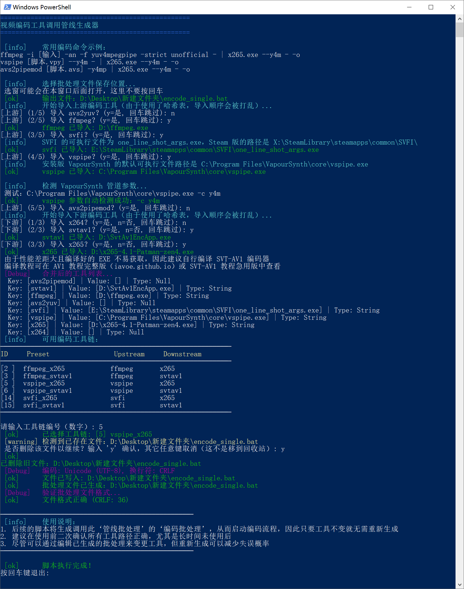

# PowerShell 批处理自定义参数压制工具

根据视频源的数据以及用户的要求，从而剥离繁琐细节，简化视频压制操作的工具。

## 环境

**支持的管道上游程序**：
- ffmpeg
- vspipe（支持 API 3.0、4.0 自动识别）
- avs2yuv
- avs2pipemod
- SVFI

**支持的管道下游程序**：
- x264
- x265
- SVT-AV1

只要系统里有一个上游、一个下游程序即可。

## 优点

- [x] 图形 + 命令行交互界面：
  - 在选择文件、路径时调用高 DPI 模式的 Win Form 选窗
  - 在基本命令行选项上使用分色编码提示 + 纯选择交互逻辑（prompt）
- [x] 自动生成无滤镜 VS/AVS 脚本：加速完成脚本构建，或直接启动 vspipe、avs2yuv、avs2pipemod 上游
- [x] 独立封装命令脚本：导入视频流，音频流，字幕轨，字体
- [x] 深度定制编码参数：自动计算 + 用户定义实现尽可能符合需求的编码器配置
- [x] 快速命令行变更：在生成的批处理中，可以直接通过复制粘贴来替换先前导入的管道上游、下游工具；轻松衍生多种处理源与视频格式

-----

## 用法

如果你需要确保安全性，则可以通过微软官方的 [PSScriptAnalyzer](https://learn.microsoft.com/en-us/powershell/utility-modules/psscriptanalyzer/overview?view=ps-modules) 检测工具来验证：
```
Invoke-ScriptAnalyzer -Path "X:\...\Batch-batch-encoder\bbenc-source" -Settings PSGallery -Recurse
```

1. Windows 11 下需要确保安装了对应文件名语言的语言包（Windows 10）
    1. 例如，阿拉伯语文件名：`设置 → 时间和语言 →[左栏] 语言 → 添加语言 → 阿拉伯语`
2. 在设置 → 更新和安全 → 开发者选项中解除 PowerShell 的运行限制，如图：

3. 解压下载好的压缩包
4. 运行步骤 1 从而完成基本环境检测
    1. 如果安装了 VSCode，则建议直接安装微软 PowerShell 插件运行
    2. VSCode 选择 `文件 → 打开文件夹 → 打开脚本根目录（...\bbenc-source\ZH v1.x\）`
    3. VSCode 需要确认“信任发布者”才能运行脚本
5. 运行步骤 2（生成编码管线批处理）、3（ffprobe 读取源）、4（生成编码任务）
6. 运行步骤 4 生成的批处理以开始编码
    1. 若有多种格式的需求，去除备用参数的注释即可
7. 运行步骤 5 以封装编码结果


<p align="center">脚本步骤 2 示例（仅 CLI 窗口，在 VSCode 中运行效果最佳）</p>

## 下载链接
<font size=3em>皆同步更新, QQ群里有很高几率能得到问题答复<br>
1: <a href='./bbenc-source'>Github直链</a>, 
2: <a href='https://drive.google.com/drive/folders/170tmk7yJBIz5eJuy7KXzqIgtvtDajyDu?usp=sharing'>谷歌盘</a>, 
3: <a href='https://pan.baidu.com/s/1jAXn066e6K7vSfUd5zJEcg'>百度云, 提取码 hevc</a>, 
4: QQ群存档: <a href='https://jq.qq.com/?_wv=1027&k=5YJFXyf'>691892901</a><br>

教程地图、工具下载见：<a href="https://iavoe.github.io/">iavoe.github.io</a>

## 打赏信息

开发这些工具并不容易。如果这套工具提高了你的效率，那么不妨赞助或推广一下下下。

<p align="center"><br></p>

## 更新信息
**v1.3.6**
- 重写了所有代码
- 使用了数组、哈希表等等更合理的数据结构
- 改进了报错逻辑
- 进一步提高了对方括号路径、文件名的支持
- 构建了全局脚本，简化了代码
- 抛弃了大批量模式
- 添加了 SVT-AV1 基础支持
- 全部参数计算功能改写为函数，提高了模块化
- 添加了分色处理的提示文本，统一化了外观
- 改进了 vspipe 支持
- 改进了 SVFI 支持
- 添加了自动 VS、AVS 无滤镜脚本生成功能
- 缓存数据集中导出到单一文件夹
- 通过追加额外的 CSV，避免了步骤 4 脚本的重复导入，避免了 ffprobe 导出 CSV 兼容问题
- 改进了步骤 1 的操作逻辑
- 改进了 Y4M 管道支持
- 完善了封装命令的操作逻辑、流程
- 增加了更多优化操作相关的提示文本
- 强化了文件导入脚本的逻辑
- 行为变更：将 RAW 管道所需参数作为附录（Appendix）一并记录到输出批处理中
- 添加了 SVT-AV1 的 ColorMatrix、Transfer、Primaries 参数生成功能
- 已完成 ffmpeg、vspipe 上游到全部下游的运行测试
  - TODO：待完成 avs2yuv、avs2pipemod、SVFI 的测试，不过理论上由于逻辑几乎完全一致，所以应该能跑...
- 测试步骤 5（封装命令）已完成测试，弃用了所有 Invoke-Expression 来增加安全性

**v0.2940**
<ul>
    <li>√ 重写了整个步骤1</li>
    <li>√ 步骤3中ffprobe导出临时csv文件的代码部分从输出到C盘根目录改成了USERPROFILE，以解决Windows11和少数Windows10的写入权限问题</li>
</ul>

**v0.2910**
<ul>
    <li>√ 步骤2S, 2M操作逻辑变更：删除 "temporary multiplex" 命令行生成，改为选中x265下游后生成提示</li>
    <li>√ 创建了 keyRoute 和 altRoute 的命令行储存变量：<ul>
        <li>√ 程序导入部分的循环, Switch逻辑性变更：<ul>
            <li>√ 上下游的程序导入合并到同一个循环中</li>
            <li>√ 用户现可在此循环中连续导入多个上下游程序</li>
            <li>√ 用户现可选择一条路径, 并在生成的批处理中直接从备选命令行中复制粘贴以替换选中的命令行</li>
            <li>√ 脚本会反馈一张显示了已导入程序的表格，即所有可用的上游，下游程序</li>
            <li>√ 稍微改进了罕见情况下的错误处理</li></ul>
        </li></ul>
    </li>
    <li>√ 创建了一块自动Switch代码，用于输入用户选择的路线并根据上下游每条路线，操作模式的所有限制条件自动生成主命令行 keyRoute 变量<ul>
        <li>√ 因变量在大批量模式下提前赋值而创建了 $sChar 变量的单引号坍缩和后期激活/展开的语句</li></ul>
    </li>
    <li>√ 创建了用于生成 altRoute 变量的循环:：<ul>
        <li>√ 自动根据输入的程序生成(注释掉的)所有可能的UNIX pipe命令行，从而实现方便用户快速在生成的批处理中替换主要命令行，即"地图化"的作用</li>
        <li>√ 变量 `$sChar 的坍缩 ... 同上</li></ul>
    </li>
    <li>√ 生成批处理文件的标题中，以及PS脚本完成后的请命提示添加了复制粘贴以更换线路，长期使用生成批处理的说明</li>
    <li>√ 变量 keyRoute, altRoute 的判断性执行：AVS2pipeMod上游程序的UNIX pipe格式不同</li>
    <li>√ 改良了whichlocation函数（确认路径）：打开的Windows Form窗口自动显示在最上方</li>
    <li>√ 使用新的Out-String函数解决了序列和表格无法正常显示/打印的问题<ul>
        <li>√ 通过在pipe到Out-String外添加括号，之外再套上变量扩张（Expansion）的方法解决了序列转字符串，字符串启用变量的问题</li></ul>
    </li>
    <li>√ 将所有常见的报错和崩溃判断集中到代码顶端的函数中，降低了代码管理难度</li>
    <li>√ 变量 dnPipeStr 的判断性执行："上下游命令行已知字长来判断路线是否存在"代码中, 大批量模式比单文件模式的命令字符串要长1char的模式区分</li>
    <li>√ 导出批处理的判断性执行：在大批量和单文件模式下，步骤2的文件名需要变量扩张（Expansion）才能被激活</li>
    <li>√ 测试所有代码并确认了一切正常</li>
    <li>√ 确认了步骤2的变更没有和步骤3产生逻辑或变量割裂</li>
    <li>√ 完成了整个 CHS 步骤2S → CHS 步骤2M 的单文件代码移植</li>
    <li>√ 完成了整个 CHS 步骤2S → ENG 步骤2S 的单文件代码移植</li>
    <li>√ 完成了整个 CHS 步骤2S → ENG 步骤2S 的单文件翻译移植</li>
    <li>√ 完成了整个 CHS 步骤2M → ENG 步骤2M 的单文件代码移植</li>
    <li>√ 完成了整个 CHS 步骤2M → ENG 步骤2M 的单文件翻译移植</li>
</ul>

**v0.2380**
<ul>
    <li>完成了大量注释，请命的文本格式统一和内容优化（改动大概150行）</li>
    <li> √ 步骤2:<ul>
        <li> √ 将整个管理输出文件名的设定流程整合进函数中</li>
        <li> √ 整个批处理生成代码的Switch重构为一体</li>
        <li> √ x264下自动（通过MUXwrt变量）将临时封装输出命令行注释掉</li>
        <li> √ 淘汰了一些（因过度设计）沦为中间量，后面用不到的变量</li>
        <li> √ 增加了一批批处理内的 "REM"，以及PSScript最后部分请命信息中用于告诉用户怎么使用和再利用生成批处理的方法</li>
        <li> √ 改良并进一步统一了函数中所有警告与报错的请命内容与格式</li>
        <li> √ 逻辑性重构优化了函数，赋值，Switch，上下游路线</li></ul>
    </li>
    <li> √ 步骤3:<ul>
        <li> √ 将整个管理输出文件名的设定流程整合进函数中</li>
        <li> √ 修复: stream_tag在MOV封装文件中用途的区别导致的兼容性问题</li>
        <li> √ 加入switchOPS变量的work-around解决了函数内无法在请命中显示字符串中变量的问题</li>
        <li> √ 修复: yuva444p10le, yua444p12le的格式支持</li>
        <li> √ 修复: x264和x265的yuv-for-mpeg命令行写法的区别导致兼容性问题</li>
        <li> √ 将 "chcp 65001" 移动到批处理命令顶部（解决 "REM" 文本显示乱码的问题）</li>
        <li> √ 增加了一批输入验证，如防止 ".exe" 输入进视频源处</li>
        <li> √ 改良了几乎所有输入验证的重试请命: 删掉用于检测的变量，而是破坏DO-While循环中本应导出的变量, While部分的检测逻辑对应到破坏结果从而触发循环</li>
        <li> √ MUXops变量以及其请命文本移动到代码顶部以方便用户调整</li>
        <li> √ 重写了围绕MUXops的所有交互逻辑, 包括注释，请命和自动操作，包括自动于x264下游线路下通过MUXwrt值切换为写入注释命令模式</li>
        <li> √ 解决了输出文件名缺失的问题</li>
        <li> √ 进一步进行了大范围的变量, 代码清理，以及脚本的宏观整理</li>
        <li> √ 淘汰了一大批（因过度设计）沦为中间量，后面用不到的变量</li>
        <li> √ 增加了大量批处理内 "REM" 信息，以告诉用户怎么使用和再利用生成批处理的方法</li>
        <li> √ 改良并进一步统一了函数中所有警告与报错的请命内容与格式</li>
        <li> √ 修复了变量 impEXTs → impEXTm 没有根据单文件/大批量模式自动切换的问题</li>
        <li> √ 修复了缺失了olsarg相关的命令行</li>
        <li> √ 启动K步骤拆分并简化（通过导出中间大量代码到函数实现）</li>
        <li> √ 逻辑性重构优化了函数，赋值，Switch，上下游路线</li></ul>
    </li>
    <li> √ 完成了整个 CHS 步骤2 单文件 → ENG 步骤2 单文件代码移植</li>
    <li> √ 完成了整个 CHS 步骤2 单文件 → CHS 步骤2 大批量代码移植</li>
    <li> √ 完成了整个 ENG 步骤2 大批量 → ENG 步骤2 大批量代码移植</li>
    <li> √ 完成了整个 ENG 步骤2 单文件 → ENG 步骤2 大批量翻译移植</li>
    <li> √ 完成了整个 CHS 步骤3 单文件 → ENG 步骤3 单文件代码移植</li>
    <li> √ 完成了整个 CHS 步骤3 单文件 → CHS 步骤3 大批量代码移植</li>
    <li> √ 完成了整个 ENG 步骤3 大批量 → ENG 步骤3 大批量代码移植</li>
    <li> √ 完成了整个 ENG 步骤3 单文件 → ENG 步骤3 大批量翻译移植</li>
    <li> √ 完成了整个 ENG 步骤2 单文件 → ENG 步骤3 单文件翻译移植</li>
    <li> √ 完成了整个 ENG 步骤2 大批量 → ENG 步骤3 大批量翻译移植</li>
</ul>

**v0.1840**
<ul>
    <li> √ 步骤 2:<ul>
        <li> √ 增加了跳过MKV封装后门的步骤，用于不生成MKV封装的工作流</li>
        <li> √ 修复了一些Error, Warning, Switch-Read以及更多种类交互信息中的排版</li>
        <li> √ 已完全支持SVFI</li>
        <li> √ 增加一道批处理的REM写入来解释xxxVar的作用</li></ul>
    </li>
    <li> √ 步骤 3: 去除了x265选项 --single-sei 以提高解码兼容性</li>
    <li> √ 步骤 3:更改了BDRip冷战参数以拓宽适用范围（跟随急用版教程更新）</li>
    <li> √ 步骤 1: 修复了UAC（用户账户控制）操作成功/失败检测的反馈文本含义问题</li>
    <li> √ 步骤 2-3: 改良了文件/路径选择函数: 用户点击取消/关闭时重新打开选择窗，而不是留着错误继续运行</li>
</ul>

**v0.1836**
<ul>
    <li> √ 步骤 3:<ul>
        <li> √ 修复了一处交互(prompt)文本错误</li>
        <li> √ 进行了交互文本易读性的整理和优化</li>
        <li> √ 现已支持选择[x264急用版教程](https://github.com/iAvoe/x264-x265-copypaste-tutorial-with-obs-record-setting)中的2种参数预设</li>
        <li> √ 现已支持选择[x265急用版教程](https://github.com/iAvoe/x264-x265-copypaste-tutorial-with-obs-record-setting)中的5种参数预设</li>
        <li> √ 强化了自动计算subme参数的反炒面能力（鲁棒性）</li>
        <li> √ 参数构建步骤增加了消除因空变量导致双空格的功能，虽然不影响功能</li>
        <li> √ 修复了一处未选择上游时临时ini路径变量传递断开的问题，虽然不影响功能</li>
        <li> √ 现已实现自动为x264，x265填写--keyint参数的能力，值为 ROUND(fps×9)</li></ul>
    </li>
</ul>

**v0.1789**
<ul>
    <li> √ 步骤3将x265 --subme，--pools，--frames的参数值计算/生成重写为函数代码， 降低了本体代码的复杂度，功能上不变</li>
    <li> √ 由于有人漏看了关闭PS解除运行限制的步骤，所以将其添加到了工作流的步骤中</li>
    <li> √ 步骤 1 增加了在多种情况下都应该能万无一失关闭用户账户控制的方案</li>
</ul>

**v0.1787**
<ul>
    <li> √ 步骤2排除了改进到新代码区分策略所引出的bug</li>
    <li> √ 步骤2跟进步骤3完成了对SVFI线路的支持. 理论上已经实现了单方面的完全支持</li>
    <li> √ 修复了步骤2和3的导出文件名选项中，输入文件名的提示文本没有针对单文件版定制的问题: 单文件模式下不填文件名集数变量</li>
    <li> √ 步骤3导入视频给ffprobe检测步骤中，增加了对误输入的手动拦截机制. 避免文件名太长导致没看清后缀的可能性</li>
    <li> √ 步骤3在改进到新代码区分策略的基础上完成了运行排查测试</li>
</ul>

**v0.1769**
<ul>
    <li> √ 步骤 2, 3 降低了大批量版与单文件版的代码复杂度:<ul>
        <li> √ 更改了代码区分策略 - 由注释屏蔽换成 if 区分:</li>
        <li> √ 效果包括代码更易读, 性能优化, 大批量与单文件版之间代码交叉跟进更简单等</li>
        <li> √ 进一步改良了一些字长不等处的缩进策略, 代码更整齐了</li></ul>
    </li>
    <li> × 由于代码改动范围非常大，所以可能会制造 bug</li>
    <li> ？ 步骤 3 推出了支持 SVFI 的完整 alpha 线路, 但目前需要等待SVFI支持输入视频格式, 因此无法进入beta状态<ul>
        <li> √ 完整线路: 大批量和单文件版中生成完整批处理命令行，且每次根据视频格式和上下游的各种要求进行适配的能力</li></ul>
    </li>
    <li> ？ 步骤 2 需要跟进步骤 3 完成 SVFI 线路的支持</li>
    <li> √ 步骤 3 将 y4m pipe 格式变为自动降级（换成 raw pipe）的策略, 以兼容 SVFI</li>
    <li> √ 步骤 3 增加了自动修改 SVFI 配置文件 ini 中 target_fps, 生成新文件的代码</li>
</ul>

**v0.1701**
<ul>
    <li> √ 改良了选择文件夹（路径）用窗口的配置:<ul>
        <li> √ 窗口内增加了拖拽边角放大的提示</li>
        <li> √ 增加了"新建文件夹"的按键</li>
        <li> √ 将"库"移除出了路径选择窗</li></ul>
    </li>
    <li> ？尝试增加Steam专业版SVFI上游程序失败: 仅支持输入png, jpg, tiff图片序列，而增加图片序列导入需增加一道上游pipe用于将视频解出图片序列. 据相关人员说明可能是steam版本较旧. 以后会修复</li>
    <li> √ 修复了步骤3中x264不支持--colormatrix unknown和--transfer unknown参数的问题, 需要翻译到--colormatrix undef和--transfer undef</li>
</ul>